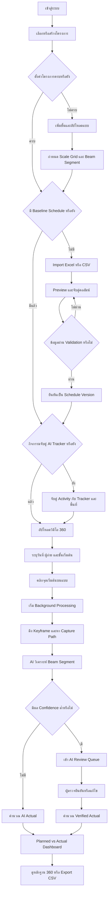
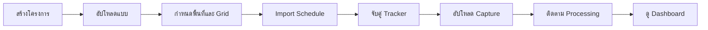
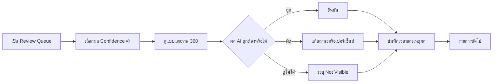
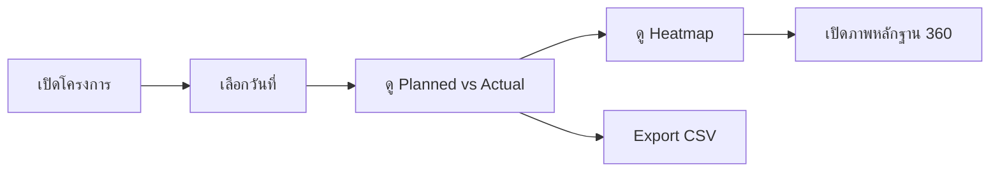
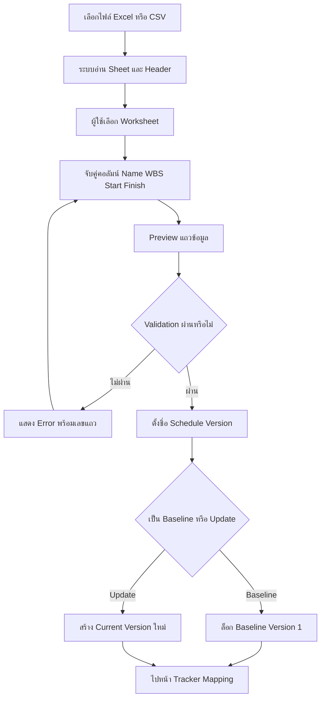
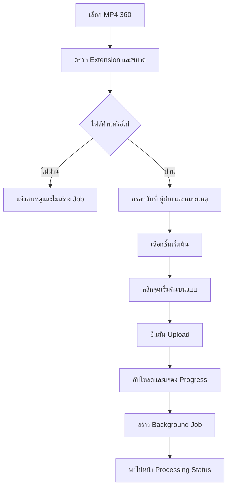
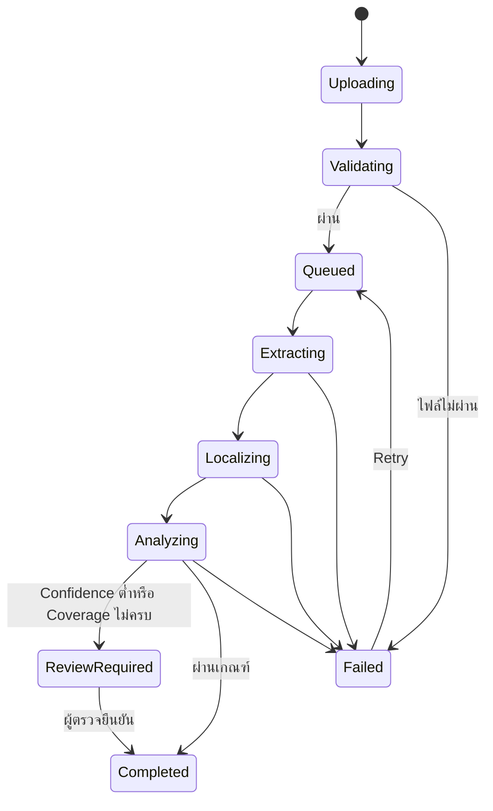

# User Flow

> **Scope v2:** Flow ที่เรียก AI Progress ด้านล่างเป็นประวัติ Baseline 1.0 ปัจจุบันผู้ตรวจเลือกองค์ประกอบบนแปลน ตรวจภาพ 360 บันทึกขั้นงาน/เปอร์เซ็นต์ และผูกหลักฐานเอง โดยคง AI/CV เฉพาะการระบุตำแหน่งภาพ

## ระบบประเมินความก้าวหน้างานก่อสร้างจากวิดีโอ 360 องศา

| รายการ | ค่า |
|---|---|
| สถานะเอกสาร | Approved - Round 2 |
| เวอร์ชัน | 1.0 |
| วันที่ | 21 สิงหาคม 2026 |
| อ้างอิง | SRS 1.0, Acceptance Criteria 1.0 |

## 1. เป้าหมายของ User Flow

กำหนดลำดับการใช้งานตั้งแต่สร้างโครงการจนถึงดู Planned vs Actual โดยลดข้อมูลที่ผู้ใช้ต้องกรอกเอง ผู้ใช้ต้องเลือกเพียงแบบ ชั้น และจุดเริ่มต้นของ Capture ส่วนการดึงภาพ หาเส้นทาง วิเคราะห์ และรวม Progress เป็นงานอัตโนมัติของระบบ

## 2. โครงสร้างเมนู

```text
เข้าสู่ระบบ
└── โครงการ
    ├── ภาพรวม
    ├── แบบและพื้นที่
    │   ├── ชั้น
    │   ├── ห้อง
    │   ├── Grid
    │   └── Beam Segment
    ├── แผนงาน
    │   ├── Import History
    │   ├── Schedule Versions
    │   └── Tracker Mapping
    ├── Captures
    │   ├── Upload
    │   ├── Processing Status
    │   └── Capture Explorer
    ├── AI Review
    ├── Progress Dashboard
    ├── Reports
    └── Project Settings
```

## 3. Primary User Flow



## 4. Flow ตามบทบาท

### 4.1 Project Administrator



### 4.2 Reviewer



### 4.3 Viewer



## 5. Project Setup Flow

### 5.1 สร้างโครงการ

1. ผู้ใช้กด `สร้างโครงการ`
2. กรอกชื่อโครงการ ที่ตั้ง เขตเวลา และคำอธิบาย
3. ระบบสร้างโครงการและพาไปหน้า Setup Checklist
4. Checklist แสดงสามงานหลัก: แบบ, Schedule และ Tracker Mapping

### 5.2 เพิ่มชั้นและห้อง

1. ผู้ใช้เพิ่มชั้น เช่น ชั้น 1-4
2. ผู้ใช้อาจกรอกชื่อห้องทันทีหรือข้ามไว้ก่อน
3. รายชื่อห้องไม่บังคับสำหรับงานคานคอดิน
4. ระบบห้ามตั้งชื่อชั้นซ้ำในโครงการเดียวกัน

### 5.3 อัปโหลดแบบ

1. ผู้ใช้เลือกชั้น
2. อัปโหลด PDF หรือภาพที่มีหนึ่งชั้นต่อหนึ่ง Sheet
3. ระบบแสดง Preview
4. ผู้ใช้เลือกพื้นที่ Crop หาก PDF มีกรอบชื่อแบบหรือข้อมูลส่วนเกิน
5. ผู้ใช้กำหนด Scale ด้วยการเลือกสองจุดและใส่ระยะจริง
6. ผู้ใช้ยืนยันแบบเป็น Active Sheet ของชั้น

### 5.4 Grid และ Beam Segment

1. ผู้ใช้เปิดเครื่องมือ Grid
2. เพิ่มแกนตัวเลขและตัวอักษร หรือ Import จากข้อมูลที่เตรียมไว้
3. ระบบสร้างรหัส Beam Segment จาก Floor + Grid Start + Grid End
4. ผู้ใช้ตรวจความยาวและประเภทคาน
5. ระบบบันทึกข้อมูลเพื่อใช้ถ่วงน้ำหนัก Actual Progress

## 6. Schedule Import Flow



### 6.1 Validation ที่ต้องมี

- Name ต้องไม่ว่าง
- WBS ต้องไม่ว่างและต้องไม่ซ้ำใน Version เดียวกัน
- Start Date ต้องอ่านเป็นวันที่ได้
- Finish Date ต้องไม่น้อยกว่า Start Date
- Summary Task และ Leaf Task ต้องแยกได้
- แถวที่ไม่ผ่านต้องไม่ถูก Import แบบเงียบ

### 6.2 กรณีไฟล์ของโครงการนี้

- เลือก Worksheet `Task_Table1`
- จับคู่ `Name`, `WBS`, `Start_Date`, `Finish_Date`
- ถ้ามี `Percent_Complete` ระบบแสดงคำเตือนและไม่นำมาเป็น Actual
- บันทึกเป็น `Baseline Version 1`
- ใช้ Start/Finish ที่ผู้ใช้ยืนยันเป็น Planned dates

### 6.3 กรอก Human Actual บนเว็บ

1. ผู้ใช้เปิดหน้าแผนงานและเลือกกิจกรรม
2. กรอกความก้าวหน้า `0–100%`, วันที่สังเกต และหมายเหตุหรือ Capture อ้างอิง (ถ้ามี)
3. ระบบบันทึกผู้กรอกและเวลาที่สร้างโดยอัตโนมัติ
4. การกรอกครั้งใหม่สร้างประวัติใหม่ ค่าครั้งก่อนยังตรวจสอบย้อนหลังได้
5. หน้า Dashboard แสดง Human Actual แยกจาก Planned, AI Actual และ Verified Actual

## 7. Activity-to-Tracker Mapping Flow

1. ระบบแสดง Leaf Activities ที่ Import สำเร็จ
2. ผู้ใช้เลือกกิจกรรม `งานผูกเหล็กคานคอดิน`
3. เลือก AI Tracker `Ground Beam Rebar`
4. เลือกชั้น 1 และ Sheet โครงสร้าง
5. เลือก Beam Segment ที่อยู่ในขอบเขตกิจกรรม
6. ระบบคำนวณความยาวรวมและแสดงวิธีคำนวณ Actual
7. ผู้ใช้ยืนยัน Mapping
8. กิจกรรมอื่นแสดง `Manual Only` จนกว่าจะมี Tracker

## 8. Capture Upload Flow



### 8.1 ข้อมูลที่ผู้ใช้ต้องให้

- ไฟล์ MP4 360 แบบ 2:1
- วันที่ถ่าย
- ผู้ถ่ายหรือทีมถ่าย
- ชั้นเริ่มต้น
- จุดเริ่มต้นหนึ่งจุด
- หมายเหตุเป็นข้อมูลไม่บังคับ

### 8.2 สิ่งที่ระบบต้องทำเอง

- ตรวจ Metadata
- ดึง Keyframe
- ประเมินทิศเริ่มต้น
- สร้าง Capture Path
- ตรวจการเปลี่ยนชั้นเมื่อรองรับ
- จับคู่ Keyframe กับแบบ
- เรียก AI Tracker
- รวม Progress และ Coverage

## 9. Processing State Flow



แต่ละสถานะต้องแสดง Timestamp, ข้อความปัจจุบัน และ Error ที่นำไปแก้ไขได้

## 10. Localization Flow

1. ระบบยึดจุดเริ่มต้นที่ผู้ใช้เลือกเป็น Anchor
2. ดึงภาพหลายมุมจากแต่ละ Keyframe
3. ประมาณการเคลื่อนที่สัมพัทธ์และทิศทางจากวิดีโอ
4. ปรับ Scale และทิศด้วยรูปทรงทางเดิน/ขอบเขตแบบ
5. ป้องกัน Path ทะลุกำแพงหรือออกนอกขอบเขตโดยไม่มีคำเตือน
6. สร้างตำแหน่งและ Confidence ของ Keyframe
7. ถ้า Confidence ต่ำ ให้แสดงช่วง Path เป็นเส้นประและส่งเข้า Review
8. การแก้ Path ด้วยมือเป็น Should scope ไม่ใช่ขั้นตอนบังคับของผู้ใช้งานปกติ

## 11. AI Review Flow

### 11.1 ลำดับ Queue

1. Not Visible หรือ Coverage ต่ำ
2. Confidence ต่ำ
3. ผลที่ขัดกับวันก่อนหน้า เช่น Progress ลดลงโดยไม่มีเหตุผล
4. Partial
5. Installed/Not Started ที่ Confidence สูง

### 11.2 การตรวจหนึ่งรายการ

1. แสดง Beam Segment บนแบบ
2. แสดงภาพ 360 และ Evidence crop
3. แสดง AI Status, Percentage และ Confidence
4. ผู้ใช้เลือก `ยืนยัน`, `แก้ไข` หรือ `ประเมินไม่ได้`
5. หากแก้ไข ต้องเลือกเหตุผลหรือกรอกหมายเหตุ
6. ระบบบันทึก Review record แยกจาก Prediction
7. ระบบเลื่อนไปรายการถัดไป

## 12. Dashboard Flow

1. ผู้ใช้เลือก Schedule Version, Activity และ Capture Date
2. ระบบแสดง Planned, AI Actual, Verified Actual, Variance และ Coverage
3. Heatmap แสดงสถานะแต่ละ Beam Segment
4. กราฟ Trend แสดงผลทุกวันที่ถ่าย
5. คลิกจุดบนกราฟเพื่อเปลี่ยน Capture Date
6. คลิก Beam Segment เพื่อเปิด Evidence
7. ผู้ใช้ Export CSV ตาม Filter ปัจจุบัน

## 13. Alternate and Error Flows

### 13.1 Schedule ไม่มี Baseline

- ระบบอนุญาตให้ผู้ใช้ตั้ง Import แรกเป็น Baseline
- เมื่อยืนยันแล้ว ห้ามเขียนทับ ต้องสร้าง Version ใหม่

### 13.2 วิดีโอเสียหรือไม่ใช่ 360

- ระบบหยุดก่อนประมวลผล AI
- แสดง Resolution, Aspect Ratio และสาเหตุที่ไม่รองรับ
- ผู้ใช้เลือกไฟล์ใหม่ได้โดยไม่สร้าง Capture ซ้ำ

### 13.3 Path หาไม่ได้

- ระบบคง Capture และ Keyframe ที่ดึงได้
- สถานะเป็น `Review Required`
- ไม่สร้าง Actual ระดับตำแหน่งโดยไม่มีคำเตือน
- ผู้ใช้ Retry ด้วยการตั้งค่าประมวลผลเดิมได้

### 13.4 ภาพไม่ครอบคลุมทุกคาน

- ระบบคำนวณ Coverage แยกจาก Actual
- Dashboard ต้องแสดงคำเตือน เช่น `Actual 42%, Coverage 68%`
- ไม่ถือ Not Visible เป็น Not Started

### 13.5 AI ไม่รองรับกิจกรรม

- แสดง `Manual Only`
- ผู้ใช้กรอก Actual เองได้ในรุ่นต่อยอด แต่ระบบไม่แสดงว่าเป็น AI Actual

## 14. จุดที่ขออนุมัติรอบที่ 2 - User Flow

1. Setup Checklist มีสามส่วน: แบบ, Schedule และ Tracker Mapping
2. รายชื่อห้องกรอกภายหลังได้และไม่บังคับสำหรับคานคอดิน
3. การอัปโหลดบังคับเลือกชั้นและจุดเริ่มต้นหนึ่งจุดเท่านั้น
4. ระบบไม่ถามทิศเริ่มต้นจากผู้ใช้
5. Capture ที่ Path หาไม่ได้เข้า Review Required แทนการสร้างผลที่ดูเหมือนสำเร็จ
6. Not Visible ไม่ถูกนับเป็น Not Started
7. Review Queue เรียงรายการที่ Confidence/Coverage ต่ำก่อน
8. Dashboard แสดง Coverage คู่กับ Actual เสมอ

## 15. บันทึกการอนุมัติ

| เวอร์ชัน | วันที่ | สถานะ | หมายเหตุ |
|---|---|---|---|
| 1.0 | 21 สิงหาคม 2026 | อนุมัติ | ผู้ใช้อนุมัติรอบที่ 2 โดยไม่มีคำขอแก้ไขเพิ่มเติม |
