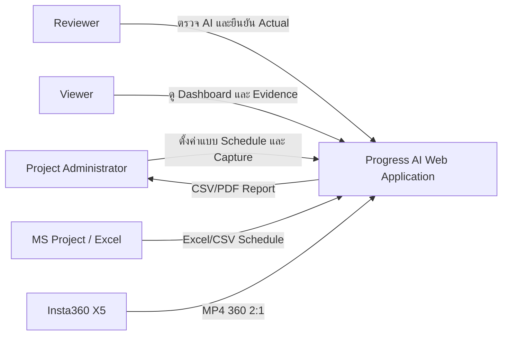
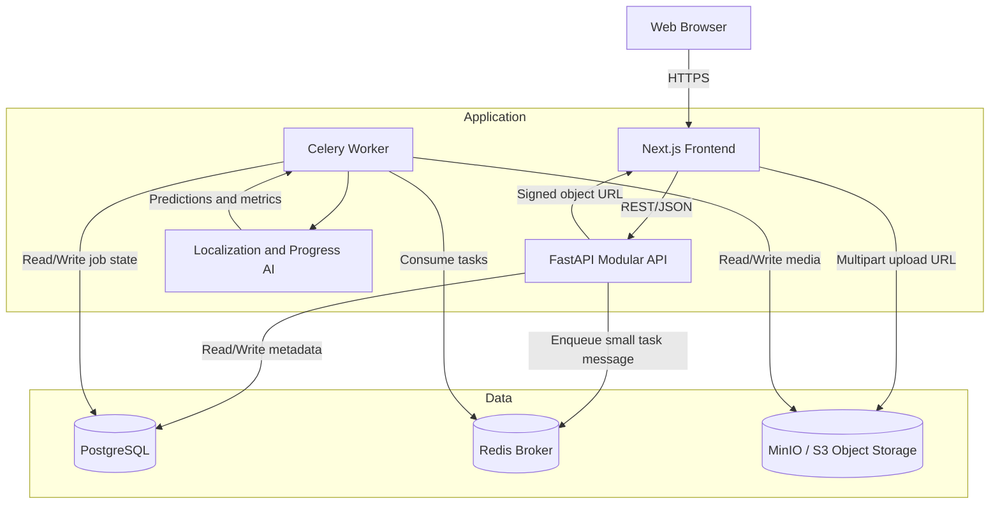
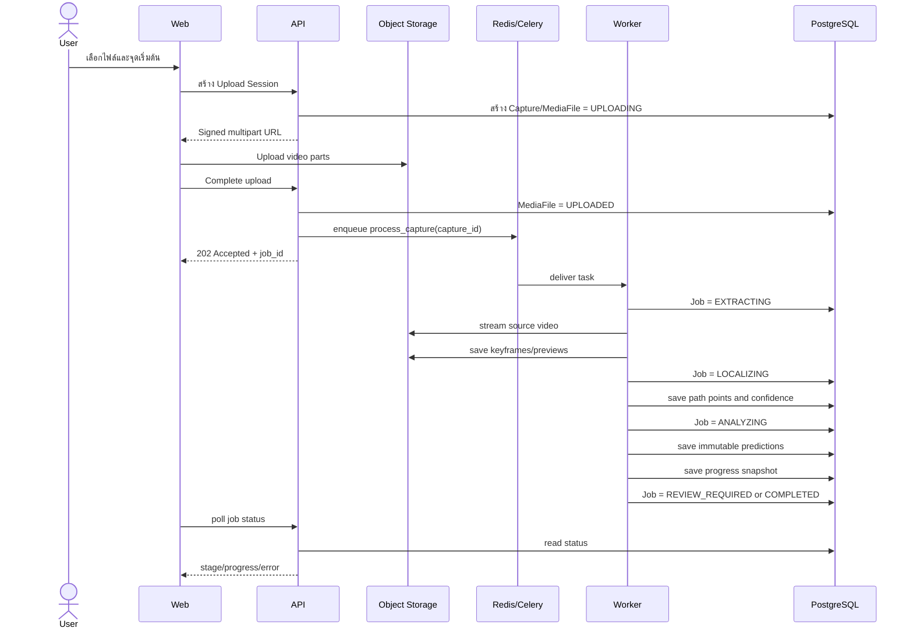
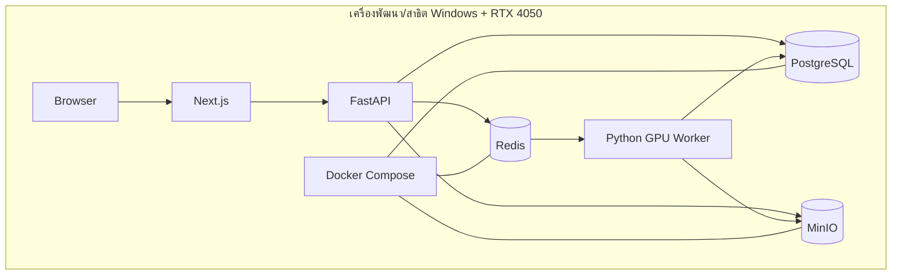
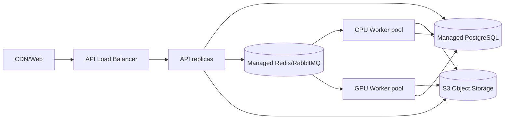

# System Architecture

> **Scope v2:** Progress Inference/Model Serving ไม่อยู่ในเส้นทางใช้งานปัจจุบัน การคำนวณ Actual รับข้อมูลที่ผู้ใช้ตรวจและยืนยันจากภาพ 360 ส่วน AI/CV ยังคงใช้ใน Localization

## ระบบประเมินความก้าวหน้างานก่อสร้างจากวิดีโอ 360 องศา

| รายการ | ค่า |
|---|---|
| สถานะเอกสาร | Approved - Round 3 |
| เวอร์ชัน | 1.0 |
| วันที่ | 21 สิงหาคม 2026 |
| รูปแบบสถาปัตยกรรม | Modular Monolith + Background Workers |
| สภาพแวดล้อมต้นแบบ | Windows/WSL2, RTX 4050, Docker Compose |

## 1. เป้าหมายสถาปัตยกรรม

1. ทำต้นแบบที่เสร็จทันวันที่ 2 ตุลาคม 2026
2. แยกงานเว็บออกจากงานประมวลผลวิดีโอและ AI ที่ใช้เวลานาน
3. รองรับไฟล์วิดีโอขนาดใหญ่โดยไม่เก็บ Binary ในฐานข้อมูล
4. เก็บ Schedule, Model และผล AI แบบมี Version เพื่อทำซ้ำงานวิจัยได้
5. เริ่มจากเครื่องเดียว แต่เปลี่ยนไปใช้ Cloud/Object Storage และหลาย Worker ได้ภายหลัง
6. ไม่เริ่มด้วย Microservices จำนวนมาก แต่กำหนดขอบเขต Module ชัดเจนเพื่อแยก Service ในอนาคตได้

## 2. Architecture Decisions

| ID | การตัดสินใจ | เหตุผล |
|---|---|---|
| ADR-01 | ใช้ Modular Monolith สำหรับ Backend | ลดเวลา Integration และ Deployment แต่ยังแยก Domain Module |
| ADR-02 | ใช้ Background Task Queue สำหรับ Video/AI | งาน 8K ใช้เวลานานและต้องทำต่อเมื่อปิดหน้าเว็บ |
| ADR-03 | เก็บไฟล์ใน Object Storage | ไฟล์ 1-10 GB ไม่เหมาะกับ PostgreSQL และต้องรองรับ Multipart |
| ADR-04 | เก็บ Metadata/ผลลัพธ์ใน PostgreSQL | ต้องการ Transaction, Constraint, Versioning และ Query รายงาน |
| ADR-05 | ใช้ Redis เป็น Broker/สถานะชั่วคราว | ตั้งค่าง่ายสำหรับต้นแบบและ Celery รองรับโดยตรง |
| ADR-06 | ผลงานสำคัญบันทึกใน PostgreSQL ไม่พึ่ง Redis เป็นแหล่งข้อมูลถาวร | Redis อาจสูญข้อมูลเมื่อหยุดกะทันหัน และไม่ใช่ Audit Store |
| ADR-07 | ใช้ MP4 360 2:1 เป็น Input ของ Visual SLAM | MP4 ที่ Stitch แล้วเข้า Pipeline โดยตรง; Camera Pose คำนวณจากภาพ ไม่ผูกกับ INSV, GPS หรือ Insta360 MediaSDK |
| ADR-08 | Prediction และ Schedule Version เป็น Immutable | ป้องกันการเปลี่ยนข้อมูลย้อนหลังและทำให้ผลวิจัยตรวจสอบได้ |
| ADR-09 | พิกัดบนแบบเก็บแบบ Normalized 0-1 | ทำงานได้แม้ภาพ Preview เปลี่ยนความละเอียด |
| ADR-10 | เริ่มโดยไม่ใช้ PostGIS | พิกัดโครงการเดียวและ Geometry ยังไม่ซับซ้อน ลดภาระติดตั้ง |

## 3. Technology Stack ที่เสนอ

| Layer | Technology | หน้าที่ |
|---|---|---|
| Frontend | Next.js App Router + TypeScript | UI, Routing, Forms, Dashboard และ Interactive Viewer |
| UI state/data | React Query หรือกลไก Fetch ที่กำหนดร่วมกัน | Cache, Loading, Retry และ Polling Job Status |
| Backend API | FastAPI + Python | REST API, Validation, Authentication และ Domain Services |
| ORM/Migration | SQLAlchemy + Alembic | Database mapping และ schema migration |
| Database | PostgreSQL | Metadata, Schedule, Capture, Prediction, Review และ Audit |
| Task Queue | Celery + Redis | ส่งและจัดคิวงานประมวลผลระยะยาว |
| Object Storage | MinIO ในต้นแบบ, S3-compatible ในอนาคต | วิดีโอต้นฉบับ, Keyframe, Preview, Model artifact และ Export |
| Video | FFmpeg/ffprobe | ตรวจ Metadata, ดึง Keyframe, Transcode และสร้าง Preview |
| Computer Vision | OpenCV + PyTorch | Preprocessing, Localization และ Progress Model |
| 360 Viewer | Pannellum หรือ Marzipano หลัง Prototype Spike | แสดง equirectangular panorama และ Sync กับ Timeline |
| Charts | Recharts หรือ Plotly หลัง Prototype Spike | Planned vs Actual และ Progress Trend |
| Testing | Pytest, Vitest, Playwright | Unit, Integration และ End-to-end |
| Deployment | Docker Compose + Native GPU Worker/WSL2 | รันบริการบนเครื่องพัฒนาและเครื่องสาธิต |

หมายเหตุทางเทคนิค:

- Next.js App Router เป็น Router หลักที่เอกสาร Next.js แนะนำสำหรับฟีเจอร์ปัจจุบัน: https://nextjs.org/docs/app
- FastAPI ระบุว่างานคำนวณหนักควรใช้ Task Queue เช่น Celery แทนการใช้ `BackgroundTasks` ใน Process เดียว: https://fastapi.tiangolo.com/tutorial/background-tasks/
- Celery รองรับ Redis เป็น Broker และ Backend แต่ระบบนี้จะเก็บสถานะธุรกิจถาวรใน PostgreSQL: https://docs.celeryq.dev/en/main/getting-started/backends-and-brokers/
- MinIO รองรับ S3-compatible SDK และ Multipart Upload ซึ่งเหมาะกับวิดีโอขนาดใหญ่: https://min.io/docs/minio/windows/operations/concepts.html

## 4. System Context



## 5. Container Architecture



กฎสำคัญ:

- Redis เก็บ Task message หรือสถานะชั่วคราวเท่านั้น ห้ามส่ง Binary video ผ่าน Redis
- Web/API ไม่ส่งวิดีโอทั้งไฟล์ผ่าน Memory ต้อง Stream หรือ Upload ตรง Object Storage
- Worker อ่านไฟล์ด้วย Object Key และเขียนผลกลับด้วย Object Key
- Client ไม่ได้รับ Storage credential ถาวร ใช้ Signed URL อายุสั้น

## 6. Backend Modules

```text
API Modular Monolith
├── auth
├── users-and-memberships
├── projects
├── floors-sheets-and-spaces
├── structural-grid
├── schedules
├── tracker-mappings
├── captures-and-media
├── processing-jobs
├── localization
├── progress-ai
├── reviews
├── progress-reporting
└── audit
```

แต่ละ Module มี Router, Schema, Service และ Repository ของตนเอง การเรียกข้าม Module ต้องผ่าน Service interface ไม่ Query ตารางของ Module อื่นกระจัดกระจาย

## 7. Frontend Architecture

```text
Next.js App
├── app
│   ├── login
│   ├── projects
│   └── projects/[projectId]
│       ├── overview
│       ├── sheets
│       ├── schedule
│       ├── tracker-mapping
│       ├── captures
│       ├── reviews
│       ├── progress
│       ├── reports
│       └── settings
├── features
│   ├── floor-plan
│   ├── panorama-viewer
│   ├── upload
│   ├── schedule-import
│   ├── capture-path
│   ├── ai-review
│   └── progress-dashboard
└── shared
    ├── api-client
    ├── auth
    ├── components
    └── types
```

หลักการ:

- Floor Plan, 360 Viewer และ Timeline เป็น Client Components เพราะต้องโต้ตอบกับ Browser
- หน้า List/Overview ใช้ Server Rendering หรือ Server Components เท่าที่เหมาะสม
- API contract สร้างจาก OpenAPI ของ FastAPI เพื่อลด Type mismatch
- Job status ใช้ Polling ในรุ่นแรกทุก 2-5 วินาที; WebSocket/SSE เป็นงานต่อยอดหากจำเป็น

## 8. Video Processing Pipeline



## 9. Processing Stages

| Stage | Input | Output | Retry boundary |
|---|---|---|---|
| Validate | Original MP4 | Metadata/validation result | Retry after replacing file |
| Extract | Valid MP4 | Keyframes, cubemap/perspective crops, thumbnails | Retry without upload |
| Quality filter | Keyframes | Blur/duplicate/visibility scores | Retry from Extract config |
| Localize | Selected start point + keyframes + sheet | Path points, floor, confidence | Retry Localization only |
| Analyze | Localized evidence + model | Immutable predictions | Retry with new Model Version |
| Aggregate | Predictions + mapping + schedule | Progress snapshot and coverage | Recompute without rerun model |
| Review | Predictions + evidence | Review records and Verified Actual | Append review; never overwrite AI |

## 10. Queue Design

### 10.1 Queues

```text
video_cpu      Validate, ffprobe, thumbnails, keyframe extraction
localization   Visual odometry, path fitting, floor transition
ai_gpu         Progress inference/training jobs using RTX 4050
reporting      CSV/PDF generation
```

ในรุ่นต้นแบบสามารถใช้ Worker process เดียวรับหลาย Queue ทีละงานเพื่อลดความซับซ้อน แต่ชื่อ Queue และ Task ต้องแยกตั้งแต่ต้น

### 10.2 Task Payload

Task ส่งเฉพาะ Identifier ขนาดเล็ก:

```json
{
  "job_id": "uuid",
  "capture_id": "uuid",
  "requested_by": "uuid",
  "pipeline_version": "v1"
}
```

ห้ามส่ง Binary, DataFrame หรือ Prediction ทั้งชุดผ่าน Broker

### 10.3 Retry and Idempotency

- Job มี `attempt_no` และ `idempotency_key`
- Output object ใช้ path ที่มี Job ID/Stage เพื่อไม่ชนกัน
- Task ตรวจว่าผล Stage เดิมสำเร็จหรือไม่ก่อนทำซ้ำ
- Prediction ของ Model Version เดิมและ Capture เดิมต้องไม่สร้างซ้ำโดยไม่มี Run ใหม่
- Error เก็บชนิด Stage, Message, Stack reference และเวลาที่เกิด

## 11. Object Storage Layout

```text
projects/{project_id}/
├── sheets/{sheet_id}/original.pdf
├── sheets/{sheet_id}/preview.webp
├── captures/{capture_id}/source/video.mp4
├── captures/{capture_id}/keyframes/{keyframe_id}.jpg
├── captures/{capture_id}/perspectives/{keyframe_id}/{view}.jpg
├── captures/{capture_id}/evidence/{prediction_id}.jpg
├── models/{model_version_id}/model.pt
└── exports/{export_id}/report.csv
```

Database เก็บ `bucket`, `object_key`, `content_type`, `size_bytes`, `checksum` และ `status` ไม่เก็บ Absolute path ของเครื่องผู้พัฒนา

## 12. Authentication and Authorization

รุ่นต้นแบบ:

- Email/password
- Password hash ด้วย Argon2 หรือ bcrypt
- Session ผ่าน HttpOnly secure cookie หรือ short-lived access token ตามรูปแบบ Deployment
- Backend เป็นผู้ตรวจ Project Membership ทุก Request
- Object URL เป็น Signed URL อายุสั้น

สิทธิ์:

| Action | Admin | Reviewer | Viewer |
|---|---:|---:|---:|
| ตั้งค่าโครงการ/แบบ/Schedule | Yes | No | No |
| Upload Capture | Yes | Optional | No |
| Review AI | Yes | Yes | No |
| ดู Dashboard/Evidence | Yes | Yes | Yes |
| Export | Yes | Yes | Optional |

## 13. Observability and Audit

- Log ทุก Request ด้วย Request ID
- Log Worker ด้วย Job ID, Capture ID และ Stage
- เก็บ Progress 0-100 ของแต่ละ Stage
- เก็บ Processing duration เพื่อใช้เปรียบเทียบเวลาในงานวิจัย
- Audit Log สำหรับ Schedule import, Mapping, Prediction run, Review และ Export
- Health endpoint แยก API, Database, Redis, Object Storage และ Worker heartbeat

## 14. Deployment - Thesis Prototype



ข้อเสนอเพื่อความเสถียร:

- PostgreSQL, Redis และ MinIO รันใน Docker Compose
- AI Worker รัน Native Python/WSL2 ที่เข้าถึง CUDA ได้ก่อน หาก GPU passthrough ใน Container ทำให้เสียเวลา
- Web/API รัน Local development process ในช่วงพัฒนา และรวม Container ภายหลังเมื่อผ่าน Integration
- Demo ต้องมี Seed project และผลประมวลผลสำรอง หาก GPU job เกิดปัญหาในวันสอบ

## 15. Deployment - Future Company



การเปลี่ยนจากต้นแบบไปบริษัทไม่ควรเปลี่ยน Domain Model แต่เปลี่ยน Infrastructure adapter และ Scale worker แยกตาม Queue

## 16. API Style

ตัวอย่าง Resource endpoint:

```text
POST   /api/projects
GET    /api/projects/{project_id}
POST   /api/projects/{project_id}/sheets
POST   /api/projects/{project_id}/schedule-imports
POST   /api/projects/{project_id}/tracker-mappings
POST   /api/projects/{project_id}/captures
POST   /api/captures/{capture_id}/upload-complete
GET    /api/captures/{capture_id}/jobs
GET    /api/captures/{capture_id}/path
GET    /api/captures/{capture_id}/predictions
POST   /api/predictions/{prediction_id}/reviews
GET    /api/projects/{project_id}/progress
POST   /api/projects/{project_id}/exports
```

กฎ API:

- Mutation ที่อาจส่งซ้ำใช้ Idempotency Key
- งานระยะยาวตอบ `202 Accepted` พร้อม Job ID
- Error response มี Code, Message, Field และ Request ID
- API ทุกตัว Scope ด้วย Project ID หรือ Membership ที่ตรวจจาก Resource

## 17. Suggested Repository Structure

```text
Progress Construction/
├── apps/
│   ├── web/                  Next.js
│   └── api/                  FastAPI modular application
├── workers/
│   ├── video/
│   ├── localization/
│   └── progress_ai/
├── packages/
│   ├── api-contracts/
│   └── shared-python/
├── ml/
│   ├── datasets/
│   ├── experiments/
│   └── models/
├── infra/
│   ├── compose.yaml
│   └── scripts/
├── docs/
│   └── planning/
├── tests/
└── Data/                     Source data; excluded from Git
```

## 18. Risks and Mitigations

| Risk | ผลกระทบ | วิธีลดความเสี่ยง |
|---|---|---|
| Celery/Redis บน Windows ไม่เสถียร | Worker เริ่มไม่ได้ | รัน Broker ใน Docker และ Worker ใน WSL2/Native; มี synchronous dev command |
| GPU Container ใช้ CUDA ไม่ได้ | AI ช้า/รันไม่ได้ | เริ่มด้วย Native GPU Worker ไม่บังคับ Container |
| Upload 8K ใหญ่มาก | Request timeout | Stream/Multipart และแยก Upload session |
| Localization ใช้เวลาวิจัยสูง | กระทบ AI/เล่ม | แยก Module, เก็บ checkpoint และมี Review Required |
| Redis หยุดกะทันหัน | Task state สูญ | Business state อยู่ PostgreSQL และ Job retry ได้ |
| Object Storage เต็ม | Upload/processing ล้ม | ตรวจ quota ก่อน Upload และแสดงพื้นที่ใช้ไป |
| Architecture ใหญ่เกินเวลา | พัฒนาไม่ทัน | เริ่มหนึ่ง API process + หนึ่ง Worker; แยกทางตรรกะก่อนแยก Service จริง |

## 19. ประเด็นสำหรับอนุมัติรอบที่ 3 - Architecture

1. ใช้ Next.js + TypeScript สำหรับ Frontend และ FastAPI + Python สำหรับ Backend
2. ใช้ PostgreSQL เป็นข้อมูลถาวร, Redis เป็น Queue และ MinIO/S3 เป็นที่เก็บไฟล์
3. ใช้ Modular Monolith + Background Worker ไม่ใช้ Microservices เต็มรูปแบบในรุ่นแรก
4. รัน PostgreSQL/Redis/MinIO ด้วย Docker Compose แต่อนุญาตให้ AI Worker รัน Native/WSL2 เพื่อใช้ RTX 4050
5. ใช้ Celery Queue และเก็บสถานะธุรกิจถาวรใน PostgreSQL
6. ส่ง Binary video ตรง Object Storage ไม่ผ่าน Redis และไม่เก็บใน Database
7. ใช้ Polling สำหรับ Job Status ในรุ่นแรก ไม่บังคับ WebSocket
8. เริ่มโดยไม่ใช้ PostGIS แต่เก็บพิกัด Normalized เพื่อย้ายภายหลังได้
9. Prediction, Schedule Version และ Model Version ต้องตรวจสอบย้อนหลังได้และไม่เขียนทับ
10. Repository ใช้โครงสร้าง Web/API/Workers/ML/Infra แยกกันภายใน Monorepo

## 20. บันทึกการอนุมัติ

| เวอร์ชัน | วันที่ | สถานะ | หมายเหตุ |
|---|---|---|---|
| 1.0 | 21 สิงหาคม 2026 | อนุมัติ | ผู้ใช้อนุมัติรอบที่ 3 และมอบหมายให้เลือกสถาปัตยกรรมที่เหมาะกับการขยายในอนาคต โดยยังต้องพัฒนาได้ทันกำหนดส่ง |
