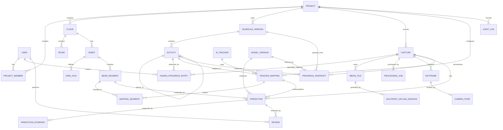
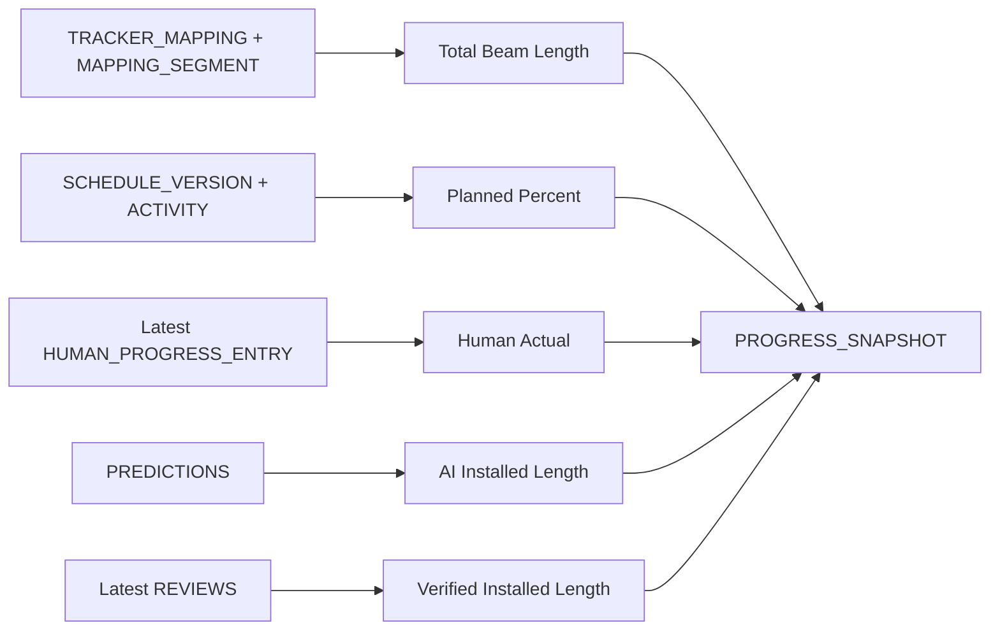

# ER Diagram and Data Model

> **Scope v2:** ตาราง/ฟิลด์ Prediction เดิมคงไว้เพื่อรักษาประวัติและความเข้ากันได้ แต่เป็นข้อมูล Legacy แบบไม่ใช้คำนวณหรือแสดง Actual ปัจจุบัน แหล่งจริงคือรายการที่ผู้ใช้บันทึกพร้อมหลักฐาน

## ระบบประเมินความก้าวหน้างานก่อสร้างจากวิดีโอ 360 องศา

| รายการ | ค่า |
|---|---|
| สถานะเอกสาร | Approved - Round 3 |
| เวอร์ชัน | 1.0 |
| วันที่ | 21 สิงหาคม 2026 |
| Database | PostgreSQL |
| Primary key | UUID |

## 1. หลักการออกแบบข้อมูล

1. ไฟล์วิดีโอและภาพเก็บใน Object Storage; Database เก็บ Metadata และ Object Key
2. วันที่เวลาเก็บเป็น UTC และแปลงแสดงตาม Timezone ของ Project
3. พิกัดบน Sheet เก็บเป็น Normalized coordinate 0-1
4. Schedule Version, Model Version และ Prediction ห้ามแก้ย้อนหลัง
5. Human Review เป็น Record ใหม่ ไม่เขียนทับ Prediction
6. Progress Snapshot เก็บผลรวม ณ Capture/Activity เพื่อให้รายงานซ้ำได้เร็ว
7. ทุกตารางหลักมี `created_at`; ตารางที่แก้ได้มี `updated_at`
8. ข้อมูลที่ต้องลบเชิงธุรกิจใช้ Archive/Soft delete ก่อน Hard delete

## 2. High-level ER Diagram



## 3. Identity and Project Tables

### 3.1 `users`

| Column | Type | Constraint/Meaning |
|---|---|---|
| id | uuid | PK |
| email | varchar | unique, normalized lowercase |
| password_hash | varchar | required; no plain password |
| display_name | varchar | required |
| is_active | boolean | default true |
| created_at | timestamptz | required |
| updated_at | timestamptz | required |

### 3.2 `projects`

| Column | Type | Constraint/Meaning |
|---|---|---|
| id | uuid | PK |
| name | varchar | required |
| location_text | varchar | nullable |
| timezone | varchar | default `Asia/Bangkok` |
| description | text | nullable |
| status | enum | ACTIVE, ARCHIVED |
| created_by | uuid | FK users |
| created_at | timestamptz | required |
| updated_at | timestamptz | required |

### 3.3 `project_members`

| Column | Type | Constraint/Meaning |
|---|---|---|
| project_id | uuid | FK projects |
| user_id | uuid | FK users |
| role | enum | ADMIN, REVIEWER, VIEWER |
| created_at | timestamptz | required |

Constraint: unique `(project_id, user_id)`

## 4. Spatial and Sheet Tables

### 4.1 `floors`

| Column | Type | Constraint/Meaning |
|---|---|---|
| id | uuid | PK |
| project_id | uuid | FK projects |
| name | varchar | เช่น ชั้น 1 |
| level_index | integer | ลำดับจากล่างขึ้นบน |
| elevation_m | numeric | nullable; ใช้ช่วย Multi-floor |
| created_at | timestamptz | required |

Constraint: unique `(project_id, name)` และ `(project_id, level_index)`

### 4.2 `rooms`

| Column | Type | Constraint/Meaning |
|---|---|---|
| id | uuid | PK |
| floor_id | uuid | FK floors |
| name | varchar | ผู้ใช้กรอกเอง |
| polygon_json | jsonb | normalized points; nullable |
| created_at | timestamptz | required |
| updated_at | timestamptz | required |

### 4.3 `sheets`

| Column | Type | Constraint/Meaning |
|---|---|---|
| id | uuid | PK |
| floor_id | uuid | FK floors |
| name | varchar | required |
| sheet_type | enum | ARCHITECTURAL, STRUCTURAL, OTHER |
| source_media_file_id | uuid | FK media_files; original PDF/image |
| preview_media_file_id | uuid | FK media_files; rendered preview |
| width_px | integer | preview width |
| height_px | integer | preview height |
| scale_m_per_normalized_unit | numeric | nullable until calibrated |
| is_active | boolean | one active sheet/type/floor |
| created_at | timestamptz | required |
| updated_at | timestamptz | required |

### 4.4 `grid_axes`

| Column | Type | Constraint/Meaning |
|---|---|---|
| id | uuid | PK |
| sheet_id | uuid | FK sheets |
| label | varchar | A, B, 1, 2 |
| axis_group | enum | ALPHA, NUMERIC, CUSTOM |
| start_x, start_y | numeric | normalized 0-1 |
| end_x, end_y | numeric | normalized 0-1 |
| created_at | timestamptz | required |

Constraint: unique `(sheet_id, axis_group, label)`

### 4.5 `beam_segments`

| Column | Type | Constraint/Meaning |
|---|---|---|
| id | uuid | PK |
| sheet_id | uuid | FK sheets |
| code | varchar | เช่น F1-B-3-C-3 |
| beam_type | varchar | B1-B6 หรือกำหนดเอง |
| start_x, start_y | numeric | normalized 0-1 |
| end_x, end_y | numeric | normalized 0-1 |
| length_m | numeric | ต้องมากกว่า 0 ก่อนใช้ Aggregate |
| source | enum | MANUAL, REVIT, IMPORT |
| is_active | boolean | default true |
| created_at | timestamptz | required |
| updated_at | timestamptz | required |

Constraint: unique `(sheet_id, code)`

## 5. Schedule Tables

### 5.1 `schedule_versions`

| Column | Type | Constraint/Meaning |
|---|---|---|
| id | uuid | PK |
| project_id | uuid | FK projects |
| name | varchar | เช่น Baseline Version 1 |
| version_no | integer | เพิ่มทีละหนึ่งใน Project |
| source_type | enum | XLSX, CSV, MPP_FUTURE |
| source_media_file_id | uuid | FK media_files |
| is_baseline | boolean | baseline ที่อนุมัติ |
| imported_by | uuid | FK users |
| imported_at | timestamptz | required |
| row_count | integer | required |
| checksum | varchar | ป้องกัน Import ไฟล์เดิมซ้ำโดยไม่ตั้งใจ |
| status | enum | VALIDATING, READY, FAILED |

Constraints:

- unique `(project_id, version_no)`
- Baseline Version ที่อนุมัติห้าม Update/Delete ผ่าน API ปกติ

### 5.2 `activities`

| Column | Type | Constraint/Meaning |
|---|---|---|
| id | uuid | PK |
| schedule_version_id | uuid | FK schedule_versions |
| parent_activity_id | uuid | self FK; nullable |
| wbs | varchar | required |
| name | varchar | required |
| planned_start | timestamptz | required |
| planned_finish | timestamptz | required |
| percent_complete_source | numeric | deprecated/nullable; รุ่นต้นแบบไม่รับค่า Actual จากไฟล์ |
| is_summary | boolean | required |
| weight | numeric | nullable |
| source_row_no | integer | ใช้รายงาน Error/Trace |
| created_at | timestamptz | required |

Constraints:

- unique `(schedule_version_id, wbs)`
- `planned_finish >= planned_start`
- `percent_complete_source` ต้องเป็น null สำหรับ Import รุ่นต้นแบบ

## 6. Tracker Configuration Tables

### 6.1 `ai_trackers`

| Column | Type | Constraint/Meaning |
|---|---|---|
| id | uuid | PK |
| code | varchar | unique; `ground_beam_rebar` |
| name | varchar | ชื่อแสดงผล |
| unit | enum | LENGTH, AREA, COUNT, MILESTONE |
| status | enum | ACTIVE, DISABLED |
| created_at | timestamptz | required |

### 6.2 `tracker_mappings`

| Column | Type | Constraint/Meaning |
|---|---|---|
| id | uuid | PK |
| project_id | uuid | FK projects |
| activity_id | uuid | FK activities |
| ai_tracker_id | uuid | FK ai_trackers |
| floor_id | uuid | FK floors |
| sheet_id | uuid | FK sheets |
| aggregation_method | enum | LENGTH_WEIGHTED, AREA_WEIGHTED, COUNT, MILESTONE |
| is_active | boolean | default true |
| created_by | uuid | FK users |
| created_at | timestamptz | required |
| updated_at | timestamptz | required |

Constraint: Activity ต้องเป็นของ Schedule Version ใน Project เดียวกัน

### 6.3 `mapping_segments`

| Column | Type | Constraint/Meaning |
|---|---|---|
| tracker_mapping_id | uuid | FK tracker_mappings |
| beam_segment_id | uuid | FK beam_segments |
| quantity_override | numeric | nullable |
| weight_override | numeric | nullable |

Constraint: unique `(tracker_mapping_id, beam_segment_id)`

## 7. Capture and Media Tables

### 7.1 `media_files`

| Column | Type | Constraint/Meaning |
|---|---|---|
| id | uuid | PK |
| project_id | uuid | FK projects |
| media_kind | enum | VIDEO, SHEET, KEYFRAME, PERSPECTIVE, EVIDENCE, MODEL, EXPORT |
| bucket | varchar | required |
| object_key | varchar | required |
| original_filename | varchar | nullable |
| content_type | varchar | required |
| size_bytes | bigint | required |
| checksum_sha256 | varchar | nullable until upload complete |
| upload_status | enum | PENDING, UPLOADING, READY, FAILED |
| created_by | uuid | FK users; nullable for worker output |
| created_at | timestamptz | required |

Constraint: unique `(bucket, object_key)`

### 7.2 `multipart_upload_sessions`

| Column | Type | Constraint/Meaning |
|---|---|---|
| id | uuid | PK |
| media_file_id | uuid | FK media_files; unique |
| provider_upload_id | varchar | Upload ID จาก S3/MinIO; unique |
| part_size_bytes | bigint | อย่างน้อย 5 MiB; รุ่นแรกใช้ 16 MiB |
| status | enum | INITIATED, COMPLETED, FAILED, ABORTED |
| expires_at | timestamptz | เวลาหมดอายุของ Signed URL ชุดล่าสุด |
| completed_at | timestamptz | nullable |
| created_at | timestamptz | required |

ระบบเรียก `ListParts` เพื่อ Resume และสร้าง Signed URL ใหม่เฉพาะ Part ที่ยังไม่สำเร็จ

### 7.3 `captures`

| Column | Type | Constraint/Meaning |
|---|---|---|
| id | uuid | PK |
| project_id | uuid | FK projects |
| source_video_id | uuid | FK media_files |
| captured_at | timestamptz | required |
| captured_by_text | varchar | ชื่อผู้ถ่าย/กล้อง |
| start_floor_id | uuid | FK floors |
| start_x, start_y | numeric | normalized 0-1 |
| notes | text | nullable |
| status | enum | UPLOADING, QUEUED, PROCESSING, REVIEW_REQUIRED, COMPLETED, FAILED |
| created_by | uuid | FK users |
| created_at | timestamptz | required |
| updated_at | timestamptz | required |

### 7.4 `processing_jobs`

| Column | Type | Constraint/Meaning |
|---|---|---|
| id | uuid | PK |
| capture_id | uuid | FK captures |
| job_type | enum | VALIDATE, EXTRACT, LOCALIZE, ANALYZE, AGGREGATE, EXPORT |
| status | enum | QUEUED, RUNNING, SUCCEEDED, FAILED, CANCELLED |
| progress_percent | numeric | 0-100 |
| attempt_no | integer | default 1 |
| idempotency_key | varchar | unique per logical run |
| pipeline_version | varchar | required |
| started_at | timestamptz | nullable |
| finished_at | timestamptz | nullable |
| error_code | varchar | nullable |
| error_message | text | nullable |
| created_at | timestamptz | required |

### 7.5 `keyframes`

| Column | Type | Constraint/Meaning |
|---|---|---|
| id | uuid | PK |
| capture_id | uuid | FK captures |
| media_file_id | uuid | FK media_files |
| frame_index | integer | required |
| timestamp_ms | bigint | required |
| blur_score | numeric | nullable |
| duplicate_score | numeric | nullable |
| quality_status | enum | USABLE, BLURRY, DUPLICATE, REJECTED |
| created_at | timestamptz | required |

Constraints: unique `(capture_id, frame_index)` และ `(capture_id, timestamp_ms)`

### 7.6 `camera_poses`

| Column | Type | Constraint/Meaning |
|---|---|---|
| id | uuid | PK |
| keyframe_id | uuid | FK keyframes; unique |
| floor_id | uuid | FK floors |
| x, y | numeric | normalized 0-1 |
| heading_deg | numeric | 0-360 |
| relative_z_m | numeric | nullable |
| confidence | numeric | 0-1 |
| localization_run_id | uuid | FK processing_jobs |
| needs_review | boolean | default false |
| created_at | timestamptz | required |

Camera Pose ของ Run ใหม่สร้าง Record ใหม่ในรุ่นที่รองรับหลาย Run; รุ่นต้นแบบอาจใช้ unique ต่อ `(keyframe_id, localization_run_id)` แทน unique keyframe เดี่ยวเพื่อเปรียบเทียบ Algorithm Version

## 8. Model and Prediction Tables

### 8.1 `model_versions`

| Column | Type | Constraint/Meaning |
|---|---|---|
| id | uuid | PK |
| ai_tracker_id | uuid | FK ai_trackers |
| version | varchar | เช่น `0.1.0` |
| model_media_file_id | uuid | FK media_files |
| training_dataset_version | varchar | required |
| metrics_json | jsonb | F1, MAE, dataset counts |
| config_json | jsonb | preprocess/inference config |
| status | enum | TRAINING, CANDIDATE, ACTIVE, RETIRED |
| created_at | timestamptz | required |

Constraint: unique `(ai_tracker_id, version)`

### 8.2 `predictions`

| Column | Type | Constraint/Meaning |
|---|---|---|
| id | uuid | PK |
| capture_id | uuid | FK captures |
| tracker_mapping_id | uuid | FK tracker_mappings |
| beam_segment_id | uuid | FK beam_segments |
| model_version_id | uuid | FK model_versions |
| analysis_job_id | uuid | FK processing_jobs |
| status | enum | NOT_VISIBLE, NOT_STARTED, PARTIAL, INSTALLED, NEEDS_REVIEW |
| progress_percent | numeric | 0-100; nullable for NOT_VISIBLE |
| confidence | numeric | 0-1 |
| visible_fraction | numeric | 0-1 |
| created_at | timestamptz | required |

Constraint แนะนำ: unique `(capture_id, tracker_mapping_id, beam_segment_id, model_version_id, analysis_job_id)`

Prediction เป็น Immutable; การรันใหม่ต้องมี Analysis Job หรือ Model Version ใหม่

### 8.3 `prediction_evidence`

| Column | Type | Constraint/Meaning |
|---|---|---|
| id | uuid | PK |
| prediction_id | uuid | FK predictions |
| keyframe_id | uuid | FK keyframes |
| media_file_id | uuid | FK media_files; optional evidence crop |
| rank | integer | ลำดับหลักฐาน |
| score | numeric | relevance/visibility score |
| bbox_or_mask_json | jsonb | nullable |
| created_at | timestamptz | required |

## 9. Human Review Tables

### 9.0 `human_progress_entries`

| Column | Type | Constraint/Meaning |
|---|---|---|
| id | uuid | PK |
| project_id | uuid | FK projects |
| activity_id | uuid | FK activities |
| capture_id | uuid | FK captures; nullable |
| observed_at | timestamptz | วันที่และเวลาที่ประเมินหน้างาน |
| progress_percent | numeric | 0-100 |
| note | text | nullable |
| entered_by_id | uuid | FK users |
| created_at | timestamptz | เวลาที่บันทึกเข้าระบบ |

Human Progress Entry เป็นประวัติแบบ Append-only ไม่มี Update/Delete API การแก้ค่าให้สร้าง Record ใหม่และเลือกค่าล่าสุดตาม `observed_at`, `created_at`

### 9.1 `reviews`

| Column | Type | Constraint/Meaning |
|---|---|---|
| id | uuid | PK |
| prediction_id | uuid | FK predictions |
| reviewer_id | uuid | FK users |
| decision | enum | CONFIRMED, CORRECTED, CANNOT_ASSESS |
| verified_status | enum | nullable when CANNOT_ASSESS |
| verified_progress_percent | numeric | 0-100; nullable |
| reason_code | enum | OCCLUDED, BLURRY, WRONG_LOCATION, AI_ERROR, OTHER |
| note | text | nullable |
| started_at | timestamptz | required |
| submitted_at | timestamptz | required |
| duration_seconds | integer | derived/validated |
| created_at | timestamptz | required |

Review ไม่ Update ทับ Record เดิม หากแก้ผลอีกครั้งให้สร้าง Review ใหม่และเลือก Latest ตาม `submitted_at`

## 10. Progress and Reporting Tables

### 10.1 `progress_snapshots`

| Column | Type | Constraint/Meaning |
|---|---|---|
| id | uuid | PK |
| project_id | uuid | FK projects |
| capture_id | uuid | FK captures |
| activity_id | uuid | FK activities |
| tracker_mapping_id | uuid | FK tracker_mappings |
| schedule_version_id | uuid | FK schedule_versions |
| model_version_id | uuid | FK model_versions |
| planned_percent | numeric | 0-100 |
| ai_actual_percent | numeric | 0-100; nullable |
| verified_actual_percent | numeric | 0-100; nullable |
| ai_variance_pp | numeric | AI Actual - Planned |
| verified_variance_pp | numeric | Verified - Planned |
| coverage_percent | numeric | 0-100 |
| segment_total | integer | required |
| segment_reviewed | integer | required |
| calculation_version | varchar | required |
| calculated_at | timestamptz | required |

Constraint แนะนำ: unique `(capture_id, tracker_mapping_id, schedule_version_id, model_version_id, calculation_version)`

Snapshot สามารถ Recompute ได้ แต่ต้องสร้าง Calculation Version ใหม่หรือเก็บประวัติผลเดิมเพื่อ Audit

### 10.2 `exports`

| Column | Type | Constraint/Meaning |
|---|---|---|
| id | uuid | PK |
| project_id | uuid | FK projects |
| media_file_id | uuid | FK media_files; nullable while processing |
| export_type | enum | CSV, PDF |
| filters_json | jsonb | Schedule/Activity/Date filters |
| status | enum | QUEUED, READY, FAILED |
| requested_by | uuid | FK users |
| created_at | timestamptz | required |
| completed_at | timestamptz | nullable |

## 11. Audit Table

### 11.1 `audit_logs`

| Column | Type | Constraint/Meaning |
|---|---|---|
| id | uuid | PK |
| project_id | uuid | FK projects; nullableสำหรับ global event |
| actor_user_id | uuid | FK users; nullable for system |
| actor_type | enum | USER, WORKER, SYSTEM |
| action | varchar | เช่น `schedule.imported` |
| entity_type | varchar | เช่น `capture` |
| entity_id | uuid | nullable |
| metadata_json | jsonb | ค่าอ้างอิงที่ไม่ใช่ secret |
| request_id | varchar | nullable |
| created_at | timestamptz | required |

Audit Log ไม่เก็บ Password, Token, Signed URL หรือข้อมูล Binary

## 12. Progress Calculation Relationships



สูตร:

```text
AI Actual % = Σ(segment length × AI segment progress) / Σ(included segment length)

Verified Actual % = Σ(segment length × latest verified progress) / Σ(included segment length)

Coverage % = Σ(segment length with usable evidence) / Σ(included segment length)

Variance (pp) = Actual % - Planned %
```

Not Visible ไม่ถูกแทนด้วย 0%; ระบบต้องแยก Coverage และใช้นโยบาย Aggregate ที่ระบุชัดเจนใน `calculation_version`

## 13. Lifecycle and Immutability

| Entity | แก้ไขได้หรือไม่ | วิธีเปลี่ยน |
|---|---|---|
| Project/Floor/Room | ได้ | Update พร้อม Audit |
| Sheet | Metadata ได้; Source ไม่เขียนทับ | Upload Sheet version ใหม่ |
| Schedule Version | ไม่ได้หลัง READY | Import Version ใหม่ |
| Activity ใน READY Version | ไม่ได้ | Import Version ใหม่ |
| Tracker Mapping | ได้ | Archive mapping เดิมและสร้าง/แก้ mapping พร้อม Audit |
| Model Version | ไม่ได้หลัง Candidate/Active | สร้าง Version ใหม่ |
| Prediction | ไม่ได้ | สร้าง Analysis Run ใหม่ |
| Review | ไม่ได้หลัง Submit | สร้าง Review ใหม่ |
| Progress Snapshot | ไม่เขียนทับผลประวัติ | Recompute เป็น Calculation Version ใหม่ |

## 14. Indexes ที่จำเป็น

```text
activities(schedule_version_id, wbs)
captures(project_id, captured_at desc)
processing_jobs(capture_id, status)
keyframes(capture_id, timestamp_ms)
camera_poses(keyframe_id, localization_run_id)
predictions(capture_id, tracker_mapping_id, beam_segment_id)
predictions(model_version_id, status)
reviews(prediction_id, submitted_at desc)
progress_snapshots(project_id, activity_id, calculated_at desc)
audit_logs(project_id, created_at desc)
```

## 15. Data Retention and Backup

รุ่นต้นแบบ:

- Source video เก็บไว้ตลอดโครงงาน
- Keyframe/Evidence เก็บจนส่งเล่มและสำรองผลทดลอง
- Temporary transcoding files ลบหลัง Job สำเร็จ
- Database backup ก่อน Demo และก่อนเริ่มการทดลองทุกชุด
- Model artifacts และ Dataset manifest ต้องสำรองพร้อม Version

รุ่นบริษัทต้องกำหนด Retention policy ต่อ Project และ Lifecycle rule ของ Object Storage

## 16. MVP Tables vs Future Tables

### Must implement

- users
- projects
- project_members
- floors
- sheets
- grid_axes
- beam_segments
- schedule_versions
- activities
- ai_trackers
- tracker_mappings
- mapping_segments
- media_files
- captures
- processing_jobs
- keyframes
- camera_poses
- model_versions
- predictions
- prediction_evidence
- reviews
- progress_snapshots
- audit_logs

### Should/Could implement later

- rooms ถ้า UI รายชื่อห้องเข้ารอบส่ง
- exports ถ้าสร้างไฟล์แบบ Background job
- activity_dependencies สำหรับ Critical Path ในอนาคต
- organizations/tenants สำหรับบริษัท
- subscriptions/billing
- BIM models/elements
- issue/field note workflows

## 17. Data Validation Rules

1. Percentage อยู่ในช่วง 0-100; Confidence/Visibility อยู่ในช่วง 0-1
2. Normalized x/y อยู่ในช่วง 0-1
3. Finish ต้องไม่น้อยกว่า Start
4. Capture และ Sheet/Mapping ต้องเป็น Project เดียวกัน
5. Beam Segment ต้องมี Length มากกว่า 0 ก่อนรวม Progress
6. Prediction ที่เป็น NOT_VISIBLE ต้องไม่มี Progress หรือถูกกันออกจาก Aggregate ตาม Calculation Version
7. Submitted Review ต้องมี End time ไม่น้อยกว่า Start time
8. Verified status/progress ต้องสอดคล้องกับ Decision
9. Object key ต้อง unique และไม่รับ path traversal จากชื่อไฟล์ผู้ใช้
10. Hard delete Entity ที่มีผลวิจัยแล้วต้องถูกปฏิเสธหรือผ่าน Admin archival workflow

## 18. ประเด็นสำหรับอนุมัติรอบที่ 3 - ER Diagram

1. ใช้ UUID เป็น Primary Key และเก็บวันที่เวลาเป็น UTC
2. ไฟล์เก็บใน Object Storage; Database เก็บเฉพาะ Metadata/Object Key
3. พิกัดแบบและ Capture Path เก็บ Normalized 0-1
4. Schedule Version, Model Version, Prediction และ Review เป็นประวัติที่ไม่เขียนทับ
5. Beam Segment เป็นหน่วยพื้นที่หลักของ Tracker คานคอดิน
6. Mapping Segment เชื่อมกิจกรรมกับช่วงคานแบบ Many-to-many
7. Human Review แยกจาก Prediction และเลือกผลล่าสุดสำหรับ Verified Actual
8. Progress Snapshot เก็บ Planned, AI Actual, Verified Actual, Variance และ Coverage
9. Not Visible ไม่ถูกนับเป็น 0% และต้องแสดง Coverage
10. เริ่มโดยไม่ใช้ PostGIS และไม่มี Organization/Billing ใน MVP

## 19. บันทึกการอนุมัติ

| เวอร์ชัน | วันที่ | สถานะ | หมายเหตุ |
|---|---|---|---|
| 1.0 | 21 สิงหาคม 2026 | อนุมัติ | ผู้ใช้อนุมัติรอบที่ 3 โดยให้ใช้ Data Model ที่ตรวจสอบย้อนหลังได้และรองรับการต่อยอดระบบในอนาคต |
