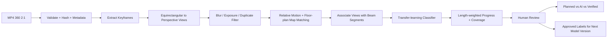
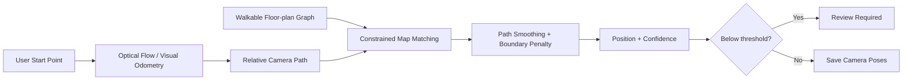
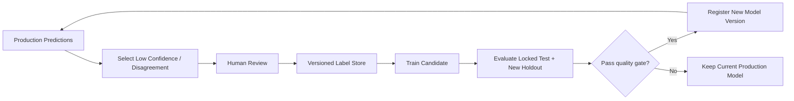

# AI and Data Pipeline

> **Scope v2:** ยกเลิกส่วน AI Progress ของ Pipeline นี้แล้วและเก็บไว้เป็นประวัติ Baseline 1.0 เฉพาะ Localization AI/CV และการเตรียมภาพ 360 ยังคงอยู่ในขอบเขต

## ระบบประเมินความก้าวหน้างานก่อสร้างจากวิดีโอ 360 องศา

| รายการ | ค่า |
|---|---|
| สถานะเอกสาร | Approved - Round 4 |
| เวอร์ชัน | 1.0 |
| วันที่ | 21 สิงหาคม 2026 |
| AI Tracker รุ่นแรก | งานผูกเหล็กคานคอดิน ชั้น 1 |
| ฮาร์ดแวร์ | NVIDIA RTX 4050 |
| เป้าหมาย Localization | ถูกต้องระดับ Grid/บริเวณอย่างน้อย 80% |
| เป้าหมาย AI | F1 Installed vs Not Installed ≥ 0.75 และ Progress MAE ≤ 15 percentage points |

## 1. คำตัดสินด้าน AI

รุ่นส่งเล่มใช้ **Hybrid Pipeline** ไม่ใช้โมเดลเดียวตัดสินทุกอย่าง และไม่ฝึกโมเดลขนาดใหญ่จากศูนย์:

1. Computer Vision แบบกำหนดขั้นตอนจัดการวิดีโอ 360 และสร้างเส้นทาง
2. Transfer Learning จำแนกหลักฐานงานเหล็กคานคอดิน
3. Floor-plan mapping เชื่อม Keyframe กับ Beam Segment
4. Rule-based aggregation คำนวณ Progress จากความยาวคาน
5. Human Review ตรวจผลที่ Confidence/Coverage ต่ำ

การแยกส่วนนี้ทำให้วัดได้ว่าความผิดพลาดมาจาก Localization, Visibility หรือโมเดลตรวจ Progress และสามารถเปลี่ยนโมเดลใดโมเดลหนึ่งภายหลังโดยไม่รื้อระบบทั้งหมด

## 2. ขอบเขตข้อมูลที่ใช้ในรุ่นแรก

### 2.1 ชุดหลักสำหรับการทดลอง

| Capture date | Input | บทบาทเบื้องต้น |
|---|---|---|
| 681223 | MP4 360 8K | Train/Validation candidate |
| 681225 | MP4 360 8K ช่วงสั้น | Train/Validation candidate; ตรวจคุณภาพก่อน |
| 681226 | MP4 360 8K | Train/Validation candidate |
| 681228 | MP4 360 8K | Locked Test candidate ตามที่ผู้ใช้ยืนยัน |

ไฟล์ `690212` แบบ `.insv/.lrv` ไม่เป็น Core Input จนกว่าจะ Export เป็น MP4 360 แบบ 2:1 แล้ว ส่วนข้อมูลวันอื่นที่เพิ่มภายหลังต้องลงทะเบียนใน Dataset Manifest ก่อนใช้งาน

### 2.2 ข้อมูลประกอบ

- แบบโครงสร้างชั้น 1 สำหรับ Grid และ Beam Segment
- Excel `งานคานชั้น 1.xlsx` สำหรับ Baseline Start/Finish
- Revit ใช้เป็นข้อมูลอ้างอิงหรือ Future Feature ไม่เป็น Dependency ของ AI รุ่นส่งเล่ม
- Human Ground Truth สำหรับตำแหน่ง, Visibility, สถานะคานและเปอร์เซ็นต์

## 3. End-to-end Pipeline



## 4. Stage A — Ingestion and Validation

เมื่อ Upload สำเร็จ ระบบต้อง:

1. คำนวณ SHA-256 เพื่อป้องกันไฟล์ซ้ำและตรวจความสมบูรณ์
2. อ่าน Codec, Width, Height, Duration, FPS และ Creation Time ด้วย `ffprobe`
3. ยืนยันว่า MP4 เปิดอ่านได้และภาพเป็น equirectangular ใกล้อัตราส่วน 2:1
4. เก็บ Source file แบบ read-only ใน Object Storage
5. สร้าง Proxy ความละเอียดต่ำสำหรับ Viewer และ Preview
6. ผูกไฟล์กับ Capture Date, ผู้ถ่าย, Starting Floor และ Start Point
7. เก็บคำสั่งและเวอร์ชันของเครื่องมือทุกขั้นเพื่อทำซ้ำได้

ไฟล์ต้นฉบับห้ามถูกเขียนทับ ผลลัพธ์จากการประมวลผลต้องอยู่ใต้ `pipeline_version` และ `capture_id`

## 5. Stage B — Keyframe and Perspective-view Generation

### 5.1 Keyframe policy

- Baseline ดึงภาพนิ่ง 360 ที่ 2 ภาพต่อวินาทีเพื่อใช้เดินตรวจแบบอิสระ และคัดภาพคมที่สุดทุกช่วง 5 วินาทีเป็น Warp Point บนแปลน
- เพิ่ม Frame รอบช่วงที่ภาพเคลื่อนเร็วหรือ Scene เปลี่ยนมาก
- ตัด Frame ซ้ำด้วย perceptual similarity
- เก็บ Timestamp จากวิดีโอ ไม่ใช้ลำดับไฟล์แทนเวลา
- Ground Truth Localization เลือกอย่างน้อย 20 Checkpoints ต่อวิดีโอ

### 5.2 ลดความบิดเบี้ยวของภาพ 360

ไม่ส่งภาพ equirectangular 8K ทั้งภาพเข้า Classifier โดยตรง ระบบแปลงแต่ละ Keyframe เป็น Perspective Views หลายทิศด้วย FFmpeg `v360` หรือฟังก์ชันที่ให้ผลเทียบเท่า แล้วเก็บ `yaw`, `pitch`, `fov` ของแต่ละ View

Baseline ที่ต้องทดลอง:

- Horizontal views: yaw 0°, 90°, 180°, 270°
- Pitch: 0° และมุมก้มที่เห็นคานคอดินชัด
- FOV: 90° โดยปรับได้จาก Config
- Output เริ่มที่ 1024×1024 หรือขนาดที่ Benchmark แล้วไม่เกินหน่วยความจำ GPU

เอกสาร FFmpeg ระบุ `v360` สำหรับแปลง projection รวม equirectangular, cubemap และ perspective: https://www.ffmpeg.org/ffmpeg-filters.html

## 6. Stage C — Image Quality and Visibility

ระบบคำนวณ Quality Features ต่อ View:

- Blur score
- Brightness/overexposure
- Motion level
- Duplicate score
- Obstruction/usable evidence จาก Label หรือโมเดลภายหลัง

กฎเริ่มต้น:

1. View ที่เบลอหรือมืดเกินเกณฑ์ไม่ถูกใช้เป็นหลักฐานหลัก
2. Beam Segment ที่ไม่มี View ใช้งานได้เป็น `NOT_VISIBLE`
3. ถ้ามีหลักฐานขัดแย้งหรือ Confidence ต่ำเป็น `NEEDS_REVIEW`
4. Quality threshold ต้องถูกบันทึกใน Pipeline Version ไม่ Hard-code กระจายหลายไฟล์

## 7. Stage D — Automatic Localization

### 7.1 เป้าหมาย

รับเพียง Starting Floor และ Start Point จากผู้ใช้ แล้วสร้าง Relative Path, Keyframe Position และ Confidence โดยอัตโนมัติ เป้าหมายวัดระดับ Grid cell/บริเวณ ไม่ใช่ความแม่นยำระดับเซนติเมตร

### 7.2 วิธีทำแบบเป็นชั้น



ลำดับการทดลอง:

1. **Baseline A:** Optical flow/feature matching เพื่อประมาณทิศและระยะสัมพัทธ์
2. **Baseline B:** Visual-odometry library ที่ Benchmark แล้วว่ารับ Perspective Views ได้
3. สร้าง Walkable Graph จากแบบและจำกัด Path ไม่ให้ทะลุขอบ/กำแพงหลัก
4. Map-match เส้นทางสัมพัทธ์เข้ากับ Graph โดยใช้ Start Point, ความต่อเนื่องและการเลี้ยว
5. Smooth ผลและสร้าง Confidence จาก feature count, reprojection/motion consistency และ map constraint
6. ถ้าระบบเลือกทางไม่ได้อย่างน่าเชื่อถือ ให้ส่ง Review Required แทนการสร้างตำแหน่งปลอม

### 7.3 Ground Truth และเกณฑ์ 80%

1. ผู้ตรวจระบุ Grid/บริเวณจริงอย่างน้อย 20 Keyframes ต่อ Capture
2. ล็อก Ground Truth ก่อนรัน Test ครั้งสุดท้าย
3. Accuracy = จำนวน Keyframes ที่อยู่ Grid/บริเวณถูกต้อง ÷ Keyframes ที่มี Ground Truth
4. รายงานแยกตาม Capture, ผู้ถ่าย, ความเร็วเดินและคุณภาพภาพ
5. ผลก่อนมนุษย์แก้ต้องได้อย่างน้อย 80%; ผลหลังแก้เก็บแยกและห้ามใช้แทนค่า Raw Accuracy

Multi-floor transition เป็น Stretch Goal และไม่ใช้เป็นเงื่อนไขผ่าน Core Pipeline

## 8. Stage E — Beam-segment Evidence Association

1. แบบชั้น 1 ถูกแบ่งเป็น Beam Segments พร้อมรหัส Grid ต้นทาง-ปลายทางและความยาว
2. Keyframe Position ถูกเชื่อมกับ Beam Segments ในรัศมี/พื้นที่มองเห็นที่กำหนด
3. Perspective View มีทิศมอง จึงเลือกเฉพาะภาพที่หันเข้าหา Segment ได้
4. เก็บหลาย Evidence Views ต่อ Segment/Date ไม่บังคับให้ภาพเดียวตัดสินทั้งหมด
5. ผู้ตรวจสามารถเปลี่ยน Evidence ที่ผูกผิดโดยไม่แก้ Prediction เดิม

รุ่นแรกอนุญาตให้ใช้กฎระยะและทิศแบบง่ายก่อน หากยังไม่มี Camera Calibration ที่เชื่อถือได้

## 9. Stage F — Progress AI Model

### 9.1 ปัญหาที่โมเดลต้องเรียนรู้

Classifier หลักเป็น Binary:

- `INSTALLED`: เห็นเหล็กคานคอดินติดตั้งใน Segment แล้ว
- `NOT_INSTALLED`: ยังไม่ติดตั้ง

สถานะระบบ `PARTIAL`, `NOT_VISIBLE` และ `NEEDS_REVIEW` เกิดจากการรวมหลาย View, Human Label และกฎ Confidence ไม่บังคับให้โมเดลรุ่นแรกเรียนรู้ห้าคลาสจากข้อมูลน้อย

### 9.2 Model strategy

1. เริ่มด้วย pretrained `ResNet18` หรือ `EfficientNet-B0` จาก TorchVision
2. ฝึกเฉพาะ Classification Head ก่อน
3. Fine-tune ชั้นท้ายเมื่อ Dataset มีจำนวนและความหลากหลายเพียงพอ
4. เปรียบเทียบอย่างน้อยหนึ่ง non-AI/simple baseline เช่น color/edge features + Logistic Regression
5. เลือกโมเดลจาก Validation F1 ไม่เลือกจาก Test Set
6. Export Model Artifact พร้อม weights, label schema, preprocessing config, metrics และ Git commit

Transfer Learning เหมาะกับ Dataset ขนาดเล็กกว่าการเริ่มน้ำหนักสุ่ม และ PyTorch มีแนวทางทั้ง fixed feature extractor และ fine-tuning: https://docs.pytorch.org/tutorials/beginner/transfer_learning_tutorial

### 9.3 Multi-view aggregation

ต่อ Beam Segment/Date:

1. ตัด View ที่ Quality ต่ำออก
2. รวม Probability ของ Views ที่เหลือด้วย median หรือ top-k mean ซึ่งต้องเลือกจาก Validation
3. ถ้าไม่มีหลักฐาน → `NOT_VISIBLE`
4. ถ้า Probability อยู่ช่วงก้ำกึ่งหรือ Views ขัดแย้ง → `NEEDS_REVIEW`
5. ถ้ามีหลักฐานเฉพาะบางช่วง → `PARTIAL` และใช้เปอร์เซ็นต์ที่ผู้ตรวจยืนยันในรุ่นแรก

## 10. Stage G — Progress Calculation

สำหรับ Segment `i`:

```text
installed_equivalent_i = length_i × progress_fraction_i

AI Actual (%) =
100 × Σ installed_equivalent_i / Σ eligible_length_i

Coverage (%) =
100 × Σ visible_length_i / Σ mapped_length_i

Variance (percentage points) = Actual - Planned
```

กฎสำคัญ:

- `progress_fraction`: Not Started = 0, Installed = 1, Partial = 0-1
- `NOT_VISIBLE` ไม่ถูกเปลี่ยนเป็น 0
- Dashboard ต้องแสดง Coverage คู่กับ Actual
- สูตรและ Threshold ทุกครั้งผูกกับ `calculation_version`
- AI Actual และ Verified Actual ใช้สูตรเดียวกัน แต่แหล่งสถานะต่างกัน

## 11. Annotation and Ground-truth Protocol

### 11.1 Label unit

หน่วย Label หลักคือ `Capture Date × Beam Segment` พร้อม Evidence Views ไม่ใช่ Frame เดี่ยวที่ติดกันจำนวนมาก

### 11.2 Label fields

- capture_id / capture_date
- beam_segment_id
- evidence_view_ids
- visibility: visible / occluded / unusable
- status: not_started / partial / installed / cannot_assess
- progress_percent 0-100 เมื่อประเมินได้
- reviewer_id
- start_time / end_time
- reason และ note

### 11.3 วิธีลดความลำเอียง

1. Manual-only รอบแรก: ผู้ตรวจไม่เห็นผล AI และระบบจับเวลา
2. AI-assisted รอบถัดไป: แสดงผล AI แล้วให้ยืนยัน/แก้และจับเวลา
3. สลับลำดับชุดข้อมูลหรือเว้นช่วง เพื่อลดการจำคำตอบเดิม
4. ให้ผู้เชี่ยวชาญ/อาจารย์ตรวจตัวอย่างอย่างน้อย 20% หากหา Reviewer คนที่สองได้
5. ข้อขัดแย้งใช้ Consensus Label และเก็บ Label เดิมไว้

## 12. Dataset Split and Leakage Prevention

ห้ามสุ่ม Frame ใกล้กันเข้าสู่คนละ Split เพราะภาพแทบเหมือนกันและทำให้คะแนนสูงเกินจริง

ลำดับที่แนะนำ:

1. ล็อก `681228` เป็น Test Set หากมี Class ทั้งสองเพียงพอ
2. ใช้วันอื่นและข้อมูลที่เพิ่มภายหลังเป็น Train/Validation โดยแบ่งตาม Capture Date หรือ Beam Segment Group
3. ถ้า Test วันเดียวมี Class ไม่ครบ ให้แบ่งแบบ Grouped split ตาม Beam Segment และล็อกกลุ่ม Test ก่อน Tune
4. เก็บ Test manifest พร้อม Hash; ห้ามเปิดคะแนน Test ซ้ำเพื่อเลือก Hyperparameter
5. รายงานจำนวน Segment, Views และสัดส่วน Class ของแต่ละ Split

## 13. Metrics

### 13.1 Localization

- Grid/area accuracy เป้าหมาย ≥ 80%
- Coverage ของ Keyframes ที่ระบบยอมให้ผล
- Error rate แยกตาม Capture/ผู้ถ่าย
- จำนวนช่วง Review Required

### 13.2 Progress classification

- Precision, Recall, F1 และ Confusion Matrix
- เป้าหมาย F1 Installed vs Not Installed ≥ 0.75
- รายงานทั้ง Macro/positive-class ตาม Label distribution

### 13.3 Progress estimation

- MAE ระหว่าง AI Actual กับ Human Verified ≤ 15 percentage points
- RMSE และ Bias (ค่าเฉลี่ย AI - Human) เป็นผลเสริม
- Error แยกตาม Date, Segment และ Coverage bin

### 13.4 Time comparison

- Manual-only duration
- AI processing duration แยกจาก Human review duration
- AI-assisted human duration
- Time saving (%) เป้าหมาย ≥ 30%

Scikit-learn มีนิยามและ implementation ของ classification metrics ที่ใช้สร้างผลซ้ำได้: https://scikit-learn.org/stable/modules/model_evaluation.html

## 14. Model Version and Reproducibility

Model Version ทุกชุดต้องเก็บ:

- model name และ architecture
- weights object key + SHA-256
- dataset manifest version/hash
- split policy และ random seed
- preprocessing/augmentation config
- hyperparameters และ training duration
- framework/CUDA versions
- validation metrics
- decision threshold
- source commit
- created_at และสถานะ Draft/Candidate/Production

Prediction ใหม่ใช้ Model Version ใหม่ ห้ามรันแล้วเขียนทับ Prediction เก่า

## 15. Active-learning Loop หลังส่งเล่ม



แนวทางนี้รองรับการต่อยอดเป็นบริษัท เพราะข้อมูลที่ผู้ใช้ตรวจจะกลายเป็น Training Data ที่มี Version โดยไม่ต้องเปลี่ยน Core API หรือฐานข้อมูล

## 16. Failure Handling

| Failure | ระบบต้องทำ |
|---|---|
| วิดีโอเสีย/Codec อ่านไม่ได้ | Reject ก่อนเข้า AI พร้อมเหตุผล |
| GPU memory ไม่พอ | ลด batch/ขนาดภาพตาม config แล้ว Retry |
| Localization ขาดช่วง | บันทึกช่วงที่ได้และ Flag ช่วงต่ำเป็น Review Required |
| ไม่มีหลักฐานของ Segment | NOT_VISIBLE และไม่รวมเป็นศูนย์ |
| โมเดลไม่โหลด/Weights ไม่ตรง | Fail Job และไม่สร้าง Snapshot |
| Prediction บางส่วนล้ม | ไม่ Publish Snapshot จน Aggregate ครบหรือถูกระบุ Partial อย่างชัดเจน |
| Reviewer แก้ผล | สร้าง Review record ใหม่ ไม่แก้ Prediction |

## 17. Quality Gates ก่อนใช้งานจริง

| Gate | เกณฑ์ |
|---|---|
| Data readiness | ทุกไฟล์มี Hash, Metadata และ Capture Date |
| Label readiness | Label schema ผ่านการทดลองและไม่มีสถานะกำกวมที่ยังไม่ตัดสิน |
| Localization candidate | Grid/area accuracy ≥ 80% บน Ground Truth ที่ล็อก |
| Model candidate | Validation F1 ≥ 0.75 และไม่มี Data Leakage |
| Thesis test | Test F1, Progress MAE และ Error Analysis ถูกบันทึกครบ |
| Production publish | Model, Dataset, Pipeline และ Calculation Version เชื่อมย้อนกลับได้ |

## 18. สิ่งที่ไม่ทำในรุ่นส่งเล่ม

- ฝึก Foundation Model หรือ 360-specific model จากศูนย์
- ตรวจงานก่อผนังและฉาบด้วยโมเดลเดียวกัน
- ใช้ Revit/IFC เป็นเงื่อนไขบังคับของ Pipeline
- Server-side stitching `.insv`
- Multi-floor localization เป็น Core Gate
- Auto-label แล้วใช้เป็น Ground Truth โดยไม่มีมนุษย์ตรวจ

## 19. ประเด็นสำหรับอนุมัติรอบที่ 4 — AI/Data Pipeline

1. ใช้ Hybrid Pipeline แยก Localization, Progress AI และ Aggregation
2. ใช้ Transfer Learning จาก TorchVision ไม่ฝึกโมเดลใหญ่จากศูนย์
3. โมเดลรุ่นแรกจำแนก Installed vs Not Installed; สถานะอื่นมาจากกฎและ Review
4. ล็อกวันที่ 681228 เป็น Test candidate และห้ามใช้ Tune จนกว่าจะตรวจ Class distribution
5. แบ่ง Dataset ตาม Capture Date/Beam Segment Group ไม่สุ่ม Frame ติดกัน
6. Localization ต้องได้ Raw Accuracy ระดับ Grid/บริเวณอย่างน้อย 80% ก่อนมนุษย์แก้
7. AI เป้าหมาย F1 ≥ 0.75 และ Progress MAE ≤ 15 percentage points
8. Actual ถ่วงน้ำหนักด้วยความยาวคานและแสดง Coverage แยก
9. เปรียบเทียบ Manual-only กับ AI-assisted โดยจับเวลาแยก AI และเวลามนุษย์
10. ทุก Dataset, Model, Pipeline, Prediction และ Calculation ต้องมี Version ตรวจย้อนหลังได้

## 20. บันทึกการอนุมัติ

| เวอร์ชัน | วันที่ | สถานะ | หมายเหตุ |
|---|---|---|---|
| 1.0 | 21 สิงหาคม 2026 | อนุมัติ | ผู้ใช้อนุมัติรอบที่ 4 โดยไม่มีคำขอแก้ไขเพิ่มเติม |
