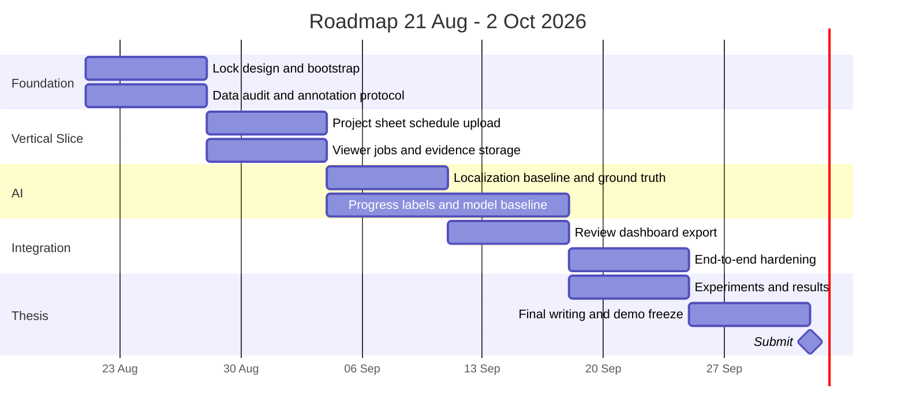

# Development Roadmap to 2 October 2026

> **Scope Amendment v2.0 — 27 สิงหาคม 2026:** ยกเลิก AI สำหรับตรวจ Progress
> งานพัฒนาปัจจุบันใช้ผู้ตรวจยืนยัน Actual จากภาพ 360; AI/CV ใน Roadmap คงไว้เฉพาะ Localization
> หัวข้อฝึกโมเดล Progress และเกณฑ์ F1/MAE/Time Saving ด้านล่างเป็นประวัติ Baseline 1.0

### แผนดำเนินงานที่ใช้แทนส่วน AI Progress

1. ทำข้อมูลตำแหน่ง/ชนิดขององค์ประกอบโครงสร้างให้ครบและตรวจรูปทรงบนแปลน
2. ตรวจความยาวคานและพื้นที่พื้นด้วยมือ แล้วแก้เฉพาะค่าที่ได้รับการยืนยัน
3. ให้ผู้ใช้บันทึกขั้นงานพร้อม Capture/Keyframe หลักฐาน และเก็บ Audit Trail
4. แสดง Planned เทียบ Human-verified Actual พร้อมจำนวนรายการที่ตรวจแล้ว
5. ทดสอบ CSV, สิทธิ์ผู้ใช้, ประวัติข้อมูล, Backup และการเปิดหลักฐานย้อนหลัง

## ระบบประเมินความก้าวหน้างานก่อสร้างจากวิดีโอ 360 องศา

| รายการ | ค่า |
|---|---|
| สถานะเอกสาร | Approved - Round 4 |
| เวอร์ชัน | 1.0 |
| วันที่เริ่มแผน | 21 สิงหาคม 2026 |
| วันส่งเล่ม | 2 ตุลาคม 2026 |
| ทีมพัฒนา | นักศึกษา 1 คน |
| หลักการ | Must-first, vertical slice, freeze ก่อนส่ง |

## 1. เป้าหมายการส่ง

ภายในวันที่ 2 ตุลาคม 2026 ต้องมี:

1. เว็บต้นแบบที่ Demo Core Flow ได้ตั้งแต่สร้างโครงการถึง Export CSV
2. ผล Localization และผลตรวจ Progress โดยผู้ใช้ที่ตรวจสอบย้อนหลังได้
3. Dashboard Planned vs Human-verified Actual อย่างน้อย 4 Captures
4. Source code, Database migration, Setup guide และชุดข้อมูล/โมเดลที่มี Version
5. เล่มโครงงานที่มี Methodology, Results, Error Analysis, Limitations และภาคผนวกการทดสอบ

## 2. กลยุทธ์ควบคุมขอบเขต

ลำดับความสำคัญตายตัว:

1. Thesis Success Gate และผลวิจัย
2. Core Web Workflow
3. Reliability/Traceability
4. UI polish
5. Should/Could และฟีเจอร์บริษัท

ห้ามเริ่ม Multi-floor, Revit import, `.insv` stitching, PDF report หรืองานก่อ/ฉาบ ก่อน Must Criteria ผ่านบนข้อมูลจริง

## 3. Timeline ภาพรวม

## 4. Week 1 — 21-27 สิงหาคม: Foundation and Data Readiness

### Development

- สร้าง Monorepo: Web, API, Worker, ML และ Infra
- ตั้ง PostgreSQL, Redis และ MinIO ด้วย Docker Compose
- ทำ FastAPI health check, Celery test job และ Next.js app shell
- สร้าง Database migrations สำหรับตาราง Must
- ทำ Authentication ขั้นต่ำและ Project CRUD
- ทำ Config/secret handling และ `.env.example`

### Data/Research

- สร้าง Dataset Inventory พร้อม Hash ของวิดีโอ 4 วัน
- ยืนยัน Metadata และ Export MP4 360 2:1
- แปลงแบบชั้น 1 เป็นภาพสำหรับ Web
- กำหนด Grid, Scale และรายการ Beam Segments
- ทดลอง Annotation 10 Segments แล้วแก้คู่มือ Label ให้ไม่กำกวม
- ล็อก Split policy และ Test candidate โดยยังไม่ Tune กับ Test

### Thesis

- เขียนบทนำ ปัญหา วัตถุประสงค์ ขอบเขตและนิยามตัวแปร
- สรุปสถาปัตยกรรมและวิธีเก็บข้อมูล

### Gate — 27 สิงหาคม

- Stack รันได้จากคำสั่งที่บันทึกไว้
- วิดีโอทั้ง 4 วันมี Manifest/Hash
- แบบชั้น 1, Grid และ Beam Segment พร้อมใช้
- Label handbook ฉบับแรกพร้อม

ถ้า Gate ไม่ผ่าน ให้หยุดงาน UI ตกแต่งและแก้ Data/Environment ก่อน

## 5. Week 2 — 28 สิงหาคม-3 กันยายน: First Vertical Slice

### Core Web

- Project setup และ Upload แบบ
- Schedule Import Wizard จาก Excel/CSV พร้อม Preview/Validation
- Schedule Version และ Planned Progress
- Activity-to-Tracker/Beam Segment Mapping
- Upload Capture, Start Point และ Job Status
- Object Storage และ Proxy generation
- 360 Viewer เปิด Keyframe ตาม Timestamp

### Pipeline

- `ffprobe` validation
- Keyframe extraction
- equirectangular-to-perspective conversion
- Quality features เบื้องต้น
- Job retry/idempotency

### Gate — 3 กันยายน

หนึ่ง Capture ต้องเดินครบ Vertical Slice:

`Upload → Process → Keyframes → Viewer → Evidence record`

พร้อม Import Excel และคำนวณ Planned ณ Capture Date ได้

## 6. Week 3 — 4-10 กันยายน: Localization and AI Baseline

### Localization

- สร้าง Walkable graph/boundary จากแบบ
- ทำ Optical-flow/visual-odometry baseline
- Map-match จาก Start Point โดยไม่ถามทิศ
- สร้าง Capture Path, Keyframe Positions และ Confidence
- ทำ Ground Truth ≥ 20 จุดต่อวิดีโอ
- วัด Accuracy แยกตาม Capture

### Progress AI

- ทำหน้าจอ/ไฟล์สำหรับ Label Capture Date × Beam Segment
- สร้าง Evidence crops/views
- ฝึก simple baseline และ pretrained classifier
- วัด Validation Precision, Recall, F1 และ Confusion Matrix

### Gate — 10 กันยายน

- Localization Raw Accuracy เป้าหมาย ≥ 80%
- Dataset split ไม่มี Frame leakage
- AI baseline ฝึกและรัน Inference บน Capture ได้

### Recovery rule

หาก Localization ต่ำกว่า 80%:

1. จำกัด Core Test ที่ชั้น 1 และคานคอดิน
2. ปรับ map constraints, sampling และ perspective views ก่อนเปลี่ยนโมเดลใหญ่
3. วิเคราะห์จุดผิดตามผู้ถ่าย/การเลี้ยว/ภาพเบลอ
4. ให้ระบบ Flag จุดไม่มั่นใจแทนการเดา
5. ห้ามใช้ตำแหน่งหลังมนุษย์แก้เป็น Raw Accuracy

## 7. Week 4 — 11-17 กันยายน: Integration and Review

### Features

- Progress inference ต่อ Beam Segment
- Multi-view aggregation และ Coverage
- AI Review Queue พร้อม Evidence/เหตุผล/จับเวลา
- เก็บ AI Prediction เดิมและ Human Review แยก
- Progress Snapshot และ Calculation Version
- Dashboard Planned/AI/Verified/Variance/Coverage
- Heatmap และ CSV Export

### AI

- Tune ด้วย Validation เท่านั้น
- เลือก Decision threshold
- Register Model Candidate
- รัน Error analysis รอบแรก

### Gate — 17 กันยายน

- Core Flow ครบอย่างน้อย 4 Captures
- Validation F1 เป้าหมาย ≥ 0.75
- AI Actual และ Verified Actual คำนวณจากความยาว Segment ถูกต้อง
- Dashboard ย้อนกลับไป Evidence ได้

## 8. Week 5 — 18-24 กันยายน: Experiment and Acceptance Testing

### Experiment

- ล็อก Model/Pipeline/Calculation Version
- รัน Locked Test Set หนึ่งครั้งสำหรับผลหลัก
- เก็บ Manual-only time และ AI-assisted review time
- คำนวณ F1, Progress MAE, RMSE, Bias และ Time saving
- วิเคราะห์ Error ตาม Capture, Segment, Coverage และ Image Quality

### System Test

- ทดสอบ Acceptance Criteria ระดับ Must ทุกข้อ
- ทดสอบ Upload, Retry, Project isolation และ Audit trail
- Benchmark 8K ~90 วินาทีบน RTX 4050
- ทดสอบ Backup/Restore Database และ Object Storage metadata
- แก้ Critical/High bugs เท่านั้นก่อน Feature เพิ่ม

### Thesis

- เขียนวิธีทดลอง ผล อภิปรายผล ข้อจำกัดและงานต่อยอด
- เก็บ Screenshot, ตารางผลและ Test evidence

### Gate — 24 กันยายน

- Progress MAE ≤ 15 percentage points หรือมี Error Analysis ครบตาม Pass with Limitation
- Must Acceptance Criteria ไม่มี Fail ที่ทำให้ข้อมูลหรือผลวิจัยผิด
- ผลทุกค่าตามกลับถึง Capture, Keyframe, Model และ Schedule Version ได้
- Draft เล่มครบทุกบท

## 9. Week 6 — 25 กันยายน-1 ตุลาคม: Freeze and Submission Package

### Code freeze

- 25 กันยายนหยุดเพิ่ม Feature
- แก้เฉพาะ Bug ที่กระทบ Demo, Data integrity หรือผลวิจัย
- ทำ Seed/demo project และ Script เตรียมข้อมูลสาธิต
- ทำ README, Installation, User Guide และ Troubleshooting
- Export Database/CSV/metrics/model manifest
- สร้าง Backup สองชุดในคนละอุปกรณ์/Cloud

### Thesis and presentation

- ตรวจตาราง/รูป/หมายเลขอ้างอิงให้ตรงกับผลจริง
- ตรวจคำว่า AI Actual, Verified Actual, Coverage และ Percentage Points ให้ใช้สม่ำเสมอ
- ซ้อม Demo แบบปกติและ Demo แบบใช้ข้อมูลที่ประมวลผลแล้วหาก GPU ล้ม
- ซ้อมตอบข้อจำกัด: ข้อมูลน้อย, โครงการเดียว, งานประเภทเดียว, Localization ระดับ Grid
- ส่งให้อาจารย์ตรวจรอบสุดท้ายก่อน 29 กันยายนถ้าเป็นไปได้

### Final Gate — 1 ตุลาคม

- Demo จาก Clean start ผ่าน
- เล่มและไฟล์ส่งเปิดได้
- Backup ทดสอบ Restore แล้ว
- ไม่มี Test Set หรือผลทดลองถูกเขียนทับ
- มีวิดีโอสำรองการ Demo

## 10. Submission Day — 2 ตุลาคม

- ตรวจไฟล์ส่งกับ Checklist
- ส่งก่อนเวลาปิดรับ ไม่ใช้วันส่งแก้ Feature
- เก็บหลักฐานการส่งและสำเนา Final ทั้งหมด

## 11. Daily Working Pattern สำหรับผู้พัฒนาคนเดียว

| ช่วง | งาน |
|---|---|
| ต้นวัน | เลือกงาน Critical Path 1 งานและกำหนดผลที่ทดสอบได้ |
| ช่วงพัฒนา | ทำ Feature พร้อม Test/Log ไม่เปิดหลาย Feature พร้อมกัน |
| ช่วงข้อมูล | Label/ตรวจ Ground Truth อย่างน้อยวันละหนึ่งรอบ |
| ท้ายวัน | Commit/Backup, บันทึกผล, Bug และงานพรุ่งนี้ |
| ทุก 2-3 วัน | รัน Vertical Slice บนข้อมูลจริงหนึ่ง Capture |
| ทุกสัปดาห์ | เก็บ Screenshot/ตารางผลเข้า Draft เล่มทันที |

## 12. Definition of Done ต่อ Feature

Feature ถือว่าเสร็จเมื่อ:

1. ทำงานผ่าน UI/API ตาม User Flow
2. มี Validation และ Error message ที่เข้าใจได้
3. มี Test ขั้นต่ำในระดับที่เหมาะสม
4. ทดลองกับข้อมูลจริงแล้ว
5. เก็บ Audit/Version ตาม SRS
6. อัปเดตเอกสารและหลักฐานสำหรับเล่ม
7. ไม่มีข้อมูลลับหรือไฟล์วิดีโอใหญ่ถูก Commit เข้า Source Control

## 13. Risk Register

| Risk | Trigger | Action |
|---|---|---|
| Localization ไม่ถึง 80% | Gate 10 ก.ย. ไม่ผ่าน | จำกัดชั้น 1, ปรับ map matching/quality, รายงาน raw result |
| Label ไม่พอหรือ Class เดียว | ก่อน Train พบ imbalance สูง | เพิ่มวัน/Segment, รวม Binary class, ใช้ class weight |
| AI F1 ต่ำ | Validation < 0.75 | ตรวจ label/evidence ก่อนเปลี่ยน architecture; ใช้ transfer learning |
| RTX/CUDA มีปัญหา | Worker รัน GPU ไม่ได้ | Native/WSL2 fallback, pin versions, เก็บ CPU smoke test |
| Upload ไฟล์ใหญ่ล้ม | ไฟล์ >2 GB ไม่สำเร็จ | ใช้ MinIO multipart; Demo ด้วยไฟล์ที่ pre-upload หากจำเป็น |
| Scope โต | เริ่มทำ Should/Could ก่อน Must ผ่าน | Freeze backlog และกลับ Critical Path |
| เล่มไม่ทัน | 17 ก.ย. Draft ยังไม่ครบครึ่ง | ลด UI polish และเขียนจากผล/หลักฐานทุกวัน |
| เครื่องเสีย/ข้อมูลหาย | Drive health/error | Backup source, DB dump, manifest และเอกสารอย่างน้อยสองที่ |

## 14. สิ่งที่เลื่อนไปหลังส่ง

- Multi-floor localization ที่สมบูรณ์
- Revit/IFC integration
- Tracker งานก่อและงานฉาบ
- `.insv` server-side stitching
- Full resumable upload 10 GB หาก 2 GB Core ผ่านแล้ว
- PDF report
- Mobile capture app
- Organization, Billing และ Cloud multi-tenant hardening
- Kubernetes/Microservices

## 15. เส้นทางต่อยอดเป็นบริษัท

หลังต้นแบบผ่าน ไม่ควร Rewrite ทันที ให้ขยายตามโหลดจริง:

1. Pilot กับ 2-3 โครงการและวัด failure pattern
2. เพิ่ม Tenant/Organization, consent, retention และ access audit
3. ย้าย PostgreSQL/Redis/S3 เป็น Managed services
4. แยก CPU/GPU Worker pool และ autoscaling
5. สร้าง Model Registry/Monitoring และ active-learning workflow
6. เพิ่ม Tracker ทีละประเภทพร้อม Acceptance Dataset ของตัวเอง
7. เพิ่ม BIM/IFC เมื่อมี Use case ที่วัดผลได้
8. พิจารณา Microservices เฉพาะเมื่อทีม/โหลด/การ Deploy แยกมีเหตุผลจริง

## 16. ประเด็นสำหรับอนุมัติรอบที่ 4 — Roadmap

1. ใช้แผน 6 สัปดาห์และ Freeze Feature วันที่ 25 กันยายน
2. Week 1-2 ต้องได้ Foundation และ Vertical Slice ก่อนปรับ AI เต็มรูปแบบ
3. Localization Gate วันที่ 10 กันยายน
4. End-to-end + AI Gate วันที่ 17 กันยายน
5. Experiment/Acceptance Gate วันที่ 24 กันยายน
6. วันที่ 25 กันยายน-1 ตุลาคมใช้สำหรับแก้บั๊ก เล่ม Demo และ Backup เท่านั้น
7. Should/Could ทั้งหมดเลื่อนได้ทันทีเมื่อกระทบ Must หรือผลวิจัย
8. บริษัทในอนาคตขยายจาก Modular Monolith ก่อน ไม่ Rewrite/Microservices โดยไม่มีหลักฐานความจำเป็น

## 17. บันทึกการอนุมัติ

| เวอร์ชัน | วันที่ | สถานะ | หมายเหตุ |
|---|---|---|---|
| 1.0 | 21 สิงหาคม 2026 | อนุมัติ | ผู้ใช้อนุมัติรอบที่ 4 และให้ใช้ Roadmap นี้เป็นแผนพัฒนาหลักถึงวันส่งเล่ม |
