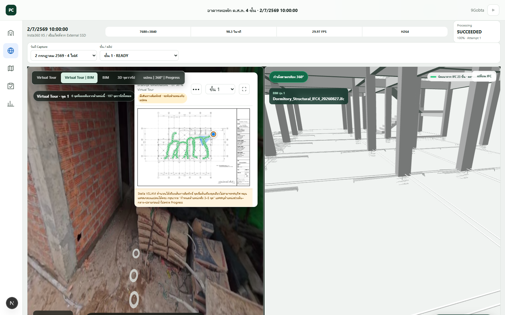
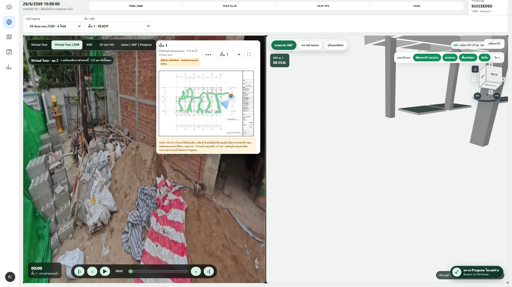

# BIM–360 alignment regression — 2026-09-08

## Scope

Verify the active structural IFC against real project captures after correcting
the viewer coordinate convention. No capture poses, routes, progress records,
or the protected 20/12/2568 reference capture were modified.

## Root cause

`web-ifc` streams placed geometry in a Three.js-compatible Y-up coordinate
frame. The viewer rotated the model by another -90 degrees and fitted the plan
against mesh X/Y, even though Y is elevation. This laid the building on its side
and allowed an apparently low-error but physically invalid camera registration.

## Correction

- Leave streamed IFC geometry in its native Y-up viewer frame.
- Register plan coordinates against horizontal mesh X/Z and use mesh Y only as
  elevation.
- Reject mirrored, sheared, or degenerate registrations before camera sync.
- Convert the complete plan heading plus panorama longitude through the fitted
  transform.
- Hide route/heading helpers in first-person follow mode so they cannot obscure
  the BIM view.
- Keep the capture viewing vector in the registered plan coordinate frame even
  when only the IFC geometry is mirrored. Reflecting the camera vector a second
  time made the BIM look toward the opposite side of the building.
- Because the reflected IFC reverses screen handedness, mirror only the BIM
  camera's horizontal projection in 360-follow mode. This preserves the correct
  position and forward direction while putting objects on the same left/right
  side as the panorama. Inspection and free-model modes retain their normal
  projection.

## Reproducible checks

- `node --experimental-strip-types --test apps/web/tests/bim-registration.test.mjs`: 3 passed.
- `npm run lint:web`: passed.
- `npm run typecheck:web`: passed.
- `NEXT_DIST_DIR=.next-share npm run build:web`: passed.
- Headless Chrome against the running application and active IFC:
  - Floor 1: 23 matched elements, RMS 0.00 m, no page errors.
  - Floor 2: 22 matched elements, RMS 0.01 m, no page errors.
  - Floor 3: 22 matched elements, RMS 0.01 m, no page errors.
  - Floor 4: 22 matched elements, RMS 0.01 m, no page errors.
- Public Quick Tunnel returned HTTP 200 after the change.
- Direction convention audit on the reported 26/6/2569 capture compared 315
  consecutive route steps. `plan heading + panorama longitude` matched the
  measured plan movement with 6.95 degrees mean and 5.93 degrees median angular
  error; adding 180 degrees produced 173.05 degrees mean error.

## Visual evidence

The paired outward-facing check is stored as
`bim-follow-heading-outward-20260626.png`: the BIM pane correctly contains no
building geometry while the panorama faces the street, then shows the
structural model when the panorama is rotated back toward the building. In the
toward-building image, the structural members now appear on the same right-hand
side as the photographed building edge rather than being horizontally swapped.
