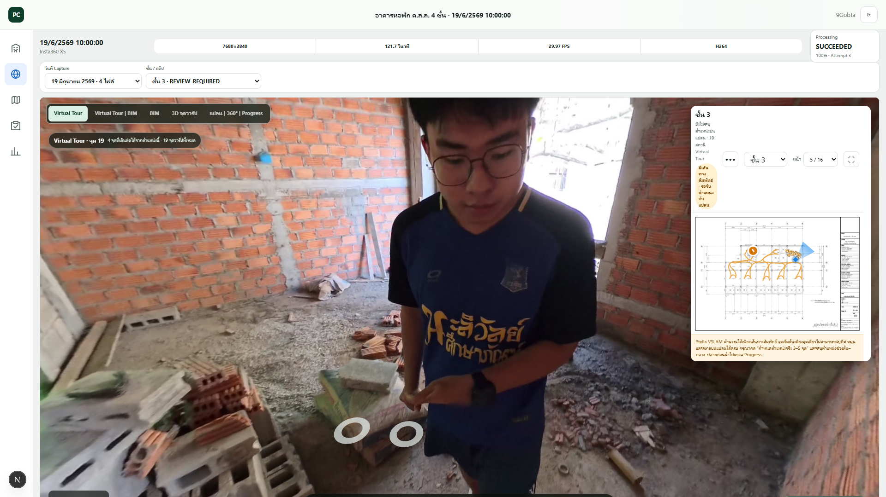

# Virtual Tour repair — 19 June 2026, floor 3

## Capture

- Capture ID: `f4d7ea6e-1f0e-437d-92c9-26d24e23b933`
- Source duration: 121.7 seconds
- Previous result: 243 camera poses collapsed onto one plan coordinate; only
  25 distinct visual positions remained in the old partial reconstruction.
- Source availability: original external MP4 found.

## Repair

1. Created a recoverable SQLite backup before localization.
2. Ran Stella VSLAM again over the complete source video.
3. Recovered 243 distinct visual camera positions.
4. Registered the recovered route against the occupied floor-3 route geometry
   from the surrounding trusted capture dates. The route was not copied from a
   different capture.
5. Updated all 243 dense path points and retained the sparse tour stations.
6. Kept the capture as `REVIEW_REQUIRED`; no human reviewer identity or review
   timestamp was fabricated.

## Result

- Plan bounds: X `0.216656–0.643550`, Y `0.299905–0.555248`.
- Browser-visible tour stations: 19.
- Current station connectivity: 3 adjacent choices.
- Local browser station change: passed.
- Public Cloudflare browser station change: passed.
- Processing attempt 3: `SUCCEEDED`.
- Protected 20 December 2025 reference route: unchanged.

