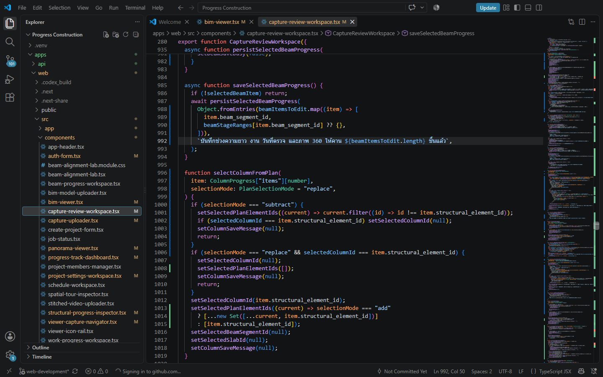
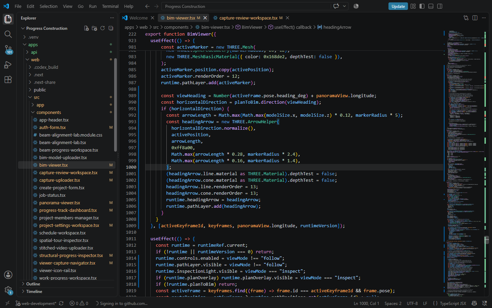
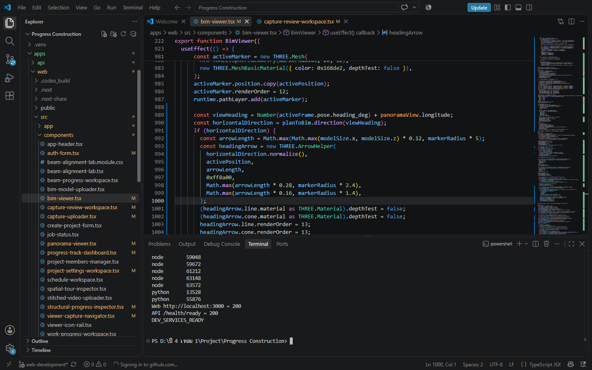
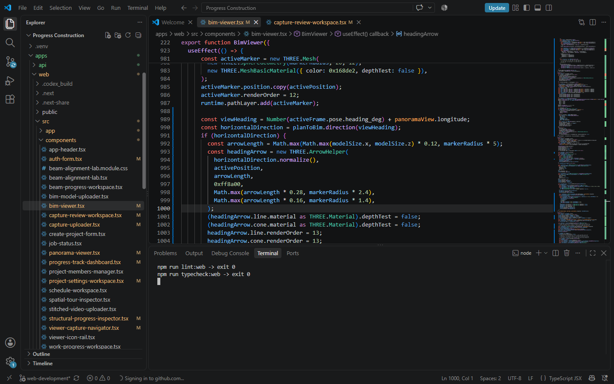
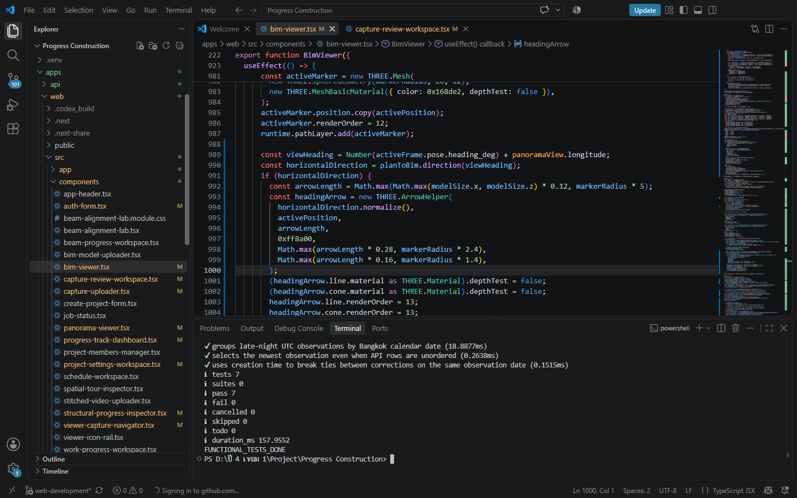
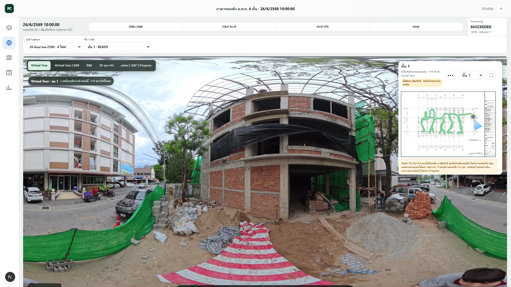
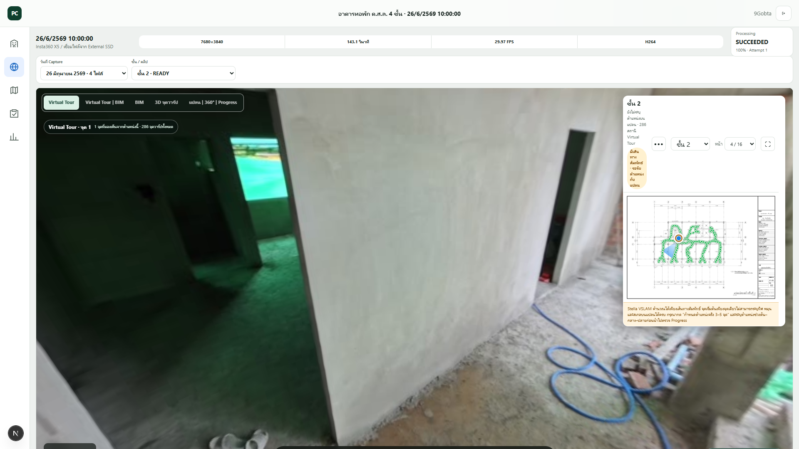
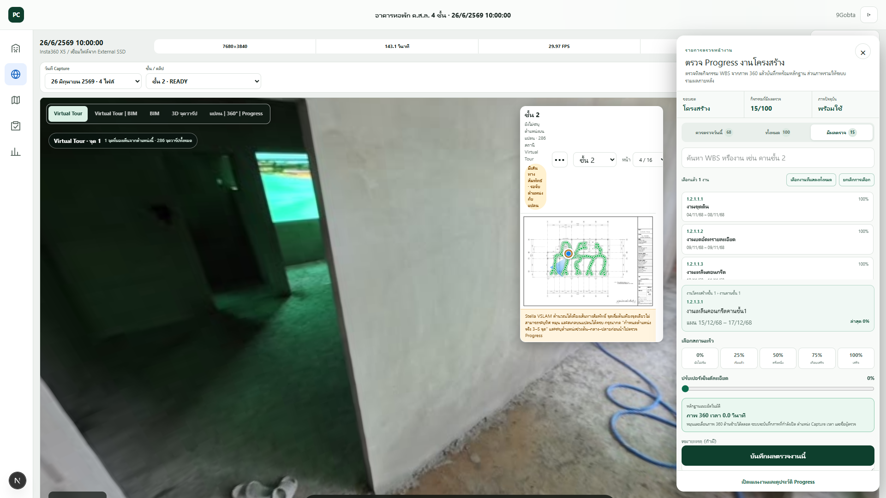
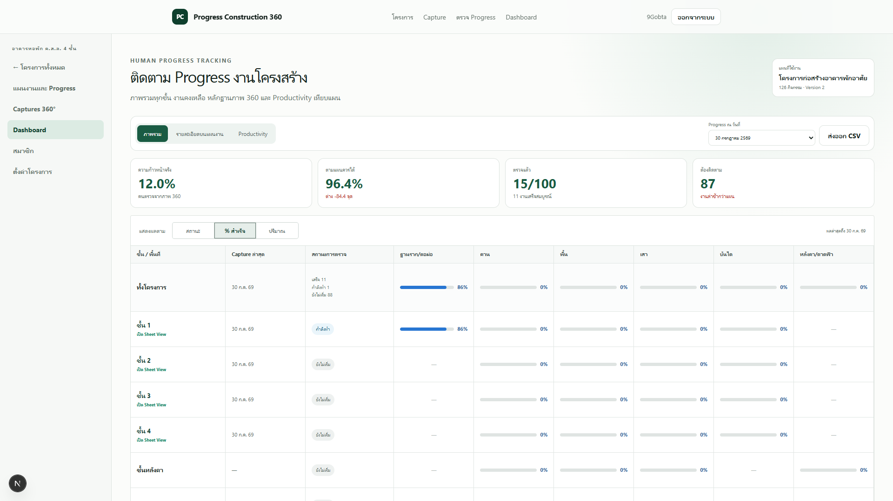
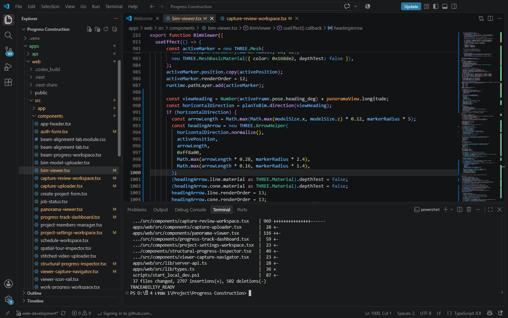

# 3.6 การใช้ Visual Studio Code ในการพัฒนาและตรวจสอบระบบ

Visual Studio Code เป็นโปรแกรมหลักที่ใช้เปิดและจัดการซอร์สโค้ดของระบบ Progress Construction 360 ตั้งแต่การตรวจสอบโครงสร้างโครงการ การแก้ไขส่วนติดต่อผู้ใช้และการเชื่อมต่อ API การเรียกใช้ระบบในสภาพแวดล้อมพัฒนา การตรวจคุณภาพซอร์สโค้ด การทดสอบ และการตรวจสอบการเปลี่ยนแปลงด้วย Git อย่างไรก็ตาม Visual Studio Code ไม่ได้ทำหน้าที่ฝึกแบบจำลองปัญญาประดิษฐ์หรือคำนวณค่าความก้าวหน้าของงานก่อสร้างโดยตรง กระบวนการระบุตำแหน่งใช้เพื่อช่วยสร้างตำแหน่งกล้องและเส้นทางของ Capture ส่วนค่าความก้าวหน้าจริงบน Dashboard มาจากข้อมูลที่ผู้ตรวจบันทึกและยืนยันจากหลักฐานภาพ 360 องศา

## 3.6.1 การเปิดโครงการและตรวจสอบโครงสร้างไฟล์

เริ่มต้นโดยเปิดโฟลเดอร์รากของโครงการ Progress Construction ใน Visual Studio Code แล้วใช้แถบ Explorer ตรวจสอบโครงสร้างไฟล์ที่เกี่ยวข้อง โครงการแบ่งส่วนหลักเป็น `apps/web` สำหรับเว็บแอปพลิเคชัน และ `apps/api` สำหรับบริการ API ภายใน `apps/web/src/components` มีส่วนประกอบของหน้าจอสำคัญ เช่น Capture, Virtual Tour, BIM, การตรวจความก้าวหน้า และ Dashboard การเปิดโครงการในระดับโฟลเดอร์รากช่วยให้ค้นหาไฟล์ ตรวจสอบความสัมพันธ์ระหว่างส่วนประกอบ และเรียกคำสั่งของทั้งโครงการจาก Terminal เดียวกันได้

## 3.6.2 การแก้ไขและตรวจสอบซอร์สโค้ด

เมื่อระบุส่วนที่ต้องพัฒนาแล้ว จึงเปิดไฟล์ที่เกี่ยวข้องใน Editor เพื่อแก้ไขหน้าเว็บ ส่วนประกอบ ชนิดข้อมูล และการเรียกใช้ API ตัวอย่างในภาพเป็นการตรวจสอบไฟล์ `bim-viewer.tsx` ซึ่งควบคุมการแสดงโมเดล BIM ตำแหน่งกล้อง เส้นทาง และทิศทางการมองที่เชื่อมโยงกับภาพ 360 องศา ส่วนการบันทึกความก้าวหน้าจะรักษาหลักการให้ผู้ตรวจเป็นผู้เลือกองค์ประกอบ ระบุขั้นงาน และยืนยันผล ระบบไม่สร้างค่าความก้าวหน้าจริงแทนผู้ตรวจโดยอัตโนมัติ

## 3.6.3 การเปิดและตรวจสอบสภาพแวดล้อมพัฒนา

ใช้ Terminal ภายใน Visual Studio Code เรียกคำสั่ง `npm run dev:local` เมื่อต้องการเปิดบริการสำหรับพัฒนาแบบครบระบบ ซึ่งประกอบด้วยเว็บ API ฐานข้อมูล และ Object Storage ที่เกี่ยวข้อง หากบริการฝั่งหลังทำงานอยู่แล้วและต้องการเปิดเฉพาะเว็บ สามารถใช้ `npm run dev:web` ได้ หลังจากเริ่มระบบแล้วตรวจสอบกระบวนการที่ทำงานและเรียก URL ของเว็บกับ API readiness เพื่อยืนยันว่าบริการพร้อมก่อนเริ่มทดสอบ ภาพประกอบแสดงผลตรวจจริงว่าเว็บที่ `http://localhost:3000` และ API พร้อมใช้งานด้วยรหัสสถานะ 200

## 3.6.4 การตรวจสอบคุณภาพซอร์สโค้ด

หลังแก้ไขซอร์สโค้ด ใช้คำสั่ง `npm run lint:web` เพื่อตรวจรูปแบบและข้อผิดพลาดเบื้องต้น ใช้ `npm run typecheck:web` เพื่อตรวจความถูกต้องของชนิดข้อมูล TypeScript และใช้ `npm run build:web` เพื่อตรวจสอบว่าสามารถสร้างเว็บสำหรับนำไปใช้งานได้ การตรวจครั้งล่าสุดเมื่อวันที่ 8 กันยายน 2569 ให้รหัสออกเป็น 0 ทั้งสามคำสั่ง หมายถึงไม่พบข้อผิดพลาดที่ทำให้คำสั่งล้มเหลว สำหรับส่วน API ต้องเรียกชุดทดสอบ `pytest` ที่เกี่ยวข้องเพิ่มเติมเมื่อมีการแก้ไขฝั่ง API

## 3.6.5 การทดสอบระบบหลังแก้ไข

การทดสอบแบ่งเป็นสองส่วน ส่วนแรกเป็นชุดทดสอบอัตโนมัติที่เรียกจาก Terminal ใน Visual Studio Code ภาพประกอบแสดงผลการทดสอบเว็บ 7 กรณีผ่านทั้งหมดและไม่พบกรณีล้มเหลว ส่วนที่สองเป็นการทดสอบตามหน้าที่จริงผ่านเว็บเบราว์เซอร์ ได้แก่ การเข้าสู่ระบบ การเปิดภาพ 360 องศา การเลือกวันหรือชั้น การเลือก Capture การตรวจตำแหน่งกล้องและเส้นทางบนแปลน การบันทึกความก้าวหน้าโดยผู้ตรวจ และการตรวจข้อมูลสรุปบน Dashboard หลังบันทึกหรือรีเฟรชหน้า ทั้งนี้ต้องยืนยันว่าค่าความก้าวหน้าจริงที่แสดงมาจากข้อมูลที่ผู้ตรวจบันทึก ไม่ใช่ค่าที่ระบบ AI สร้างขึ้นเอง

## 3.6.6 การจัดเก็บหลักฐานและตรวจสอบย้อนกลับด้วย Git

ก่อนนำการเปลี่ยนแปลงไปใช้ ตรวจสอบสถานะไฟล์ด้วย `git status --short` และตรวจขนาดของการเปลี่ยนแปลงด้วย `git diff --stat` เพื่อทราบว่าไฟล์ใดถูกเพิ่ม แก้ไข หรือลบ จากนั้นเก็บวันที่ทดสอบ คำสั่ง ผลลัพธ์ และภาพหน้าจอไว้เป็นหลักฐาน การเขียนรายงานต้องระบุสถานะตามจริงว่าเป็นการเปลี่ยนแปลงใน Working Tree หรือเป็น commit แล้ว และเมื่อบันทึกเป็น commit ควรอ้างอิงหมายเลข commit เพื่อให้ตรวจสอบย้อนกลับได้

ภาพประกอบทั้งหมดในหัวข้อนี้เป็นภาพหน้าจอจากการใช้งาน Visual Studio Code และระบบเว็บจริงของโครงการเมื่อวันที่ 8 กันยายน 2569 โดยไม่มีการแสดงรหัสผ่าน access token หรือข้อมูลรับรองสำหรับเข้าสู่ระบบ
